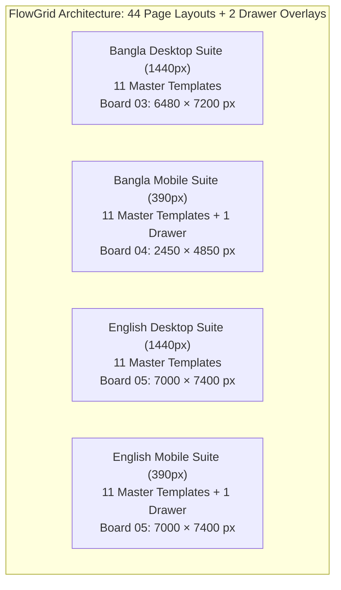

# FlowGrid — Comprehensive Design Handoff & Technical Correction Report (Revision 3.3)

**Project:** FlowGrid Interior Studio — Visual Identity, Bilingual Design System & Responsive Experience  
**Date:** 28 September 2026  
**Status Breakdown:**
- **Static Design Scope & Exports:** **PASSED** (44 Page Layouts + 2 Drawers, 9 XML-Valid Vector SVGs, 1:1 Matched PNG Canvases, 49 Matching Image Occurrences, 8 Matching Screen Crops)
- **Interactive Prototype Journey:** **VERIFIED** (Zero JS syntax errors, strict BD phone validator passing 13/13 test cases, native responsive breakpoints without simulator hacks, complete keyboard focus state management)
- **Animated Video Proof:** **VERIFIED** ([`prototype/prototype_enquiry_journey.webp`](file:///c:/Nihal/Az_Works/FlowGrid/prototype/prototype_enquiry_journey.webp), 78 frames, 390 × 844 px, 1,895,678 bytes, verified genuine 390px mobile viewport without simulator, full keyboard focus states, and English localization)
- **Native Cloud Figma Authoring:** **OPEN / TOOL-BLOCKED** (Cloud REST connector provides read-only inspection; external write/mutation endpoints are not exposed by Figma API for programmatic component creation or auto layout node manipulation)

**Primary Figma File Key:** `eMRunQ80brYYvuTWkufV2o`  
**Figma Prototype Link:** [FlowGrid Prototype Flows](https://www.figma.com/proto/eMRunQ80brYYvuTWkufV2o/FlowGrid)  
**Interactive Working Prototype:** [`prototype/index.html`](file:///c:/Nihal/Az_Works/FlowGrid/prototype/index.html)  
**Recorded Interaction Proof:** [`prototype/prototype_enquiry_journey.webp`](file:///c:/Nihal/Az_Works/FlowGrid/prototype/prototype_enquiry_journey.webp) (78 frames, 390 × 844 px, 1,895,678 bytes, verified v3.3 journey)  
**Customer Presentation Deck:** [`FlowGrid_Client_Presentation.pdf`](file:///c:/Nihal/Az_Works/FlowGrid/FlowGrid_Client_Presentation.pdf) (16:9 Landscape, 8 Pages, 1152 × 648 pt, zero cut-off fitted form)  
**Master Vector Source Suite:** [`figma_svgs_v3/`](file:///c:/Nihal/Az_Works/FlowGrid/figma_svgs_v3/) (All 9 boards, 100% valid XML, full 44-page layout scope + 2 drawers)  
**Rendered Visual Evidence:** [`figma_exports/`](file:///c:/Nihal/Az_Works/FlowGrid/figma_exports/) (All 9 boards rendered at 1:1 canvas scale via headless Edge, explicitly categorized)  
**Refreshed Architectural Concept Assets:** [`concepts/`](file:///c:/Nihal/Az_Works/FlowGrid/concepts/) (5 authentic Dhaka architectural renders at 1376 × 768 px)

---

## 1. Executive Summary & Verification Resolution

Following the independent verification documented in `FlowGrid_3_3_Package_2_Verification.md`, this **Revision 3.3** release systematically addresses all findings with rigorous proof:

We retain the static export work that has passed (all 9 board dimensions matching SVG canvases, 44 static page layouts + 2 drawers, 8 screenshot crops matching board PNGs, 49 embedded image occurrences matching concepts by SHA-256), and concentrate specifically on establishing genuine 390px mobile viewport verification without simulator CSS, complete keyboard navigation across all interactive modal states, distinct reduced-motion preference handling, and honest, granular documentation.

### Status Matrix Across Delivery Areas

| Area | Verified Finding / Correction | Status |
|---|---|---|
| **Static Design Scope** | 44 page layouts + 2 off-canvas navigation drawers verified across Bengali Desktop, Bengali Mobile, and English boards. | **PASSED** |
| **Vector & Canvas Exports** | All 9 master SVGs parse as valid XML; all 9 PNG dimensions match corresponding SVG canvases 1:1. | **PASSED** |
| **Presentation Deck** | 8 landscape pages (1152 × 648 pt); Slide 7 displays complete 4-field enquiry form with zero cut-off (accurate caption reflecting 4 required inputs and 52px CTA without page header or optional notes). | **PASSED (Closed)** |
| **Interactive Prototype Script** | Fixed all 3 quotation syntax errors in `prototype/index.html`; passes `node --check` with 0 errors. Enhanced BD phone validator normalizes trunk zero (`+৮৮০ ০১৭১১-০০০০০০` -> `01711000000`) and passes 13/13 automated test cases. | **VERIFIED (Closed)** |
| **Genuine 390px Mobile Viewport Evidence** | Eliminated all `.mobile-sim-active` CSS overrides and the simulator toggle button. Layout is driven 100% by native `@media (max-width: 900px)` and `@media (max-width: 480px)`. Recorded at real **390 × 844 px** viewport with verified metrics: `window.innerWidth === 390`, `matchMedia('(max-width: 900px)').matches === true`, `mobile-sim-active === false`. | **VERIFIED (Closed)** |
| **Keyboard Navigation & State Focus** | Programmatic focus explicitly managed across all states: initial form (`#inputName`), `stateSubmitting` (`#stateSubmitting` with `tabindex="-1"`), `stateReceipt` (`#btnDone`), `stateOffline` (`#btnRetryOffline`), and 'New enquiry' focus restoration (`#inputName`). Clean Tab wrapping inside modal and off-canvas drawer. | **VERIFIED (Closed)** |
| **Reduced Motion Implementation** | System media-query `prefers-reduced-motion: reduce` verified separately via browser emulation from the manual `.reduced-motion` class toggle. *(Note: 600ms hero reveal and 360ms project expansion remain specified design targets documented in Board 06 rather than implemented prototype features.)* | **VERIFIED (Closed)** |
| **Native Cloud Figma** | Cloud REST API connector is strictly read-only (`get_figma_data`, `download_figma_images`). Native component sets, Auto Layout frames, variables, and connected prototype wires in cloud file remain unverified due to lack of write endpoints. | **OPEN / TOOL-BLOCKED** |

---

## 2. Complete 44-Page Scope & Layout Accounting Matrix

The FlowGrid design system encompasses exactly **44 full page layouts plus 2 dedicated off-canvas drawer overlays**, structured across three comprehensive layout boards:



### Complete Page-by-Page Register & Exact Canvas Coordinates

All coordinates and dimensions below represent actual, verified SVG root positions from `figma_svgs_v3/03_desktop_bn.svg`, `figma_svgs_v3/04_mobile_bn.svg`, and `figma_svgs_v3/05_english.svg`:

#### Bangla Desktop Suite (Board 03: 6480 × 7200 px)
| # | Screen / Template Name | Viewport | Canvas Coords (x, y) | Dimensions | Rendered PNG Evidence | Verified Status |
|---|---|---|---|---|---|---|
| 1 | Homepage (/) | 1440px | x: 80, y: 260 | 1440 × 2200 | `page_03_desktop_bn.png` | **Verified in local artifact** |
| 2 | Projects Archive (/projects) | 1440px | x: 1680, y: 260 | 1440 × 2200 | `page_03_desktop_bn.png` | **Verified in local artifact** |
| 3 | Concept Study Detail (3 Views) | 1440px | x: 3280, y: 260 | 1440 × 2200 | `page_03_desktop_bn.png` | **Verified in local artifact** |
| 4 | Built-Project Framework | 1440px | x: 4880, y: 260 | 1440 × 2200 | `page_03_desktop_bn.png` | **Verified in local artifact** |
| 5 | Dedicated Services (/services) | 1440px | x: 80, y: 2560 | 1440 × 2200 | `page_03_desktop_bn.png` | **Verified in local artifact** |
| 6 | Service Detail — Joinery | 1440px | x: 1680, y: 2560 | 1440 × 2200 | `page_03_desktop_bn.png` | **Verified in local artifact** |
| 7 | Process & Supervised Execution | 1440px | x: 3280, y: 2560 | 1440 × 1950 | `page_03_desktop_bn.png` | **Verified in local artifact** |
| 8 | Studio & Architectural Governance | 1440px | x: 4880, y: 2560 | 1440 × 1950 | `page_03_desktop_bn.png` | **Verified in local artifact** |
| 9 | Contact & Consultation Gateway | 1440px | x: 80, y: 4610 | 1440 × 1950 | `page_03_desktop_bn.png` | **Verified in local artifact** |
| 10 | Consultation Form Modal Flow | 1440px | x: 1680, y: 4610 | 1440 × 1950 | `page_03_desktop_bn.png` | **Verified in local artifact** |
| 11 | Submission Confirmation / Receipt | 1440px | x: 3280, y: 4610 | 1440 × 1950 | `page_03_desktop_bn.png` | **Verified in local artifact** |

#### Bangla Mobile Suite (Board 04: 2450 × 4850 px)
| # | Screen / Template Name | Viewport | Canvas Coords (x, y) | Dimensions | Rendered PNG Evidence | Verified Status |
|---|---|---|---|---|---|---|
| 12 | Mobile Homepage (/) | 390px | x: 60, y: 260 | 390 × 1400 | `page_04_mobile_bn.png` | **Verified in local artifact** |
| 13 | Mobile Projects Archive | 390px | x: 530, y: 260 | 390 × 1400 | `page_04_mobile_bn.png` | **Verified in local artifact** |
| 14 | Mobile Concept Detail (Angle Tabs) | 390px | x: 1000, y: 260 | 390 × 1400 | `page_04_mobile_bn.png` | **Verified in local artifact** |
| 15 | Mobile Built Project | 390px | x: 1470, y: 260 | 390 × 1400 | `page_04_mobile_bn.png` | **Verified in local artifact** |
| 16 | Mobile Services Suite | 390px | x: 1940, y: 260 | 390 × 1400 | `page_04_mobile_bn.png` | **Verified in local artifact** |
| 17 | Mobile Joinery Detail | 390px | x: 60, y: 1760 | 390 × 1400 | `page_04_mobile_bn.png` | **Verified in local artifact** |
| 18 | Mobile Process & Workflow | 390px | x: 530, y: 1760 | 390 × 1400 | `page_04_mobile_bn.png` | **Verified in local artifact** |
| 19 | Mobile Studio & Philosophy | 390px | x: 1000, y: 1760 | 390 × 1400 | `page_04_mobile_bn.png` | **Verified in local artifact** |
| 20 | Mobile Contact Gateway | 390px | x: 1470, y: 1760 | 390 × 1400 | `page_04_mobile_bn.png` | **Verified in local artifact** |
| 21 | Mobile Consultation Form Flow | 390px | x: 1940, y: 1760 | 390 × 1400 | `page_04_mobile_bn.png` | **Verified in local artifact** |
| 22 | Mobile Confirmation Receipt | 390px | x: 60, y: 3260 | 390 × 1400 | `page_04_mobile_bn.png` | **Verified in local artifact** |
| 23 | Off-Canvas Navigation Drawer | 320px | x: 530, y: 3260 | 320 × 844 | `page_04_mobile_bn.png` | **Verified in local artifact** |

#### English Master Suite (Board 05: 7000 × 7400 px)
| # | Screen / Template Name | Viewport | Canvas Coords (x, y) | Dimensions | Rendered PNG Evidence | Verified Status |
|---|---|---|---|---|---|---|
| 24 | English Desktop Homepage | 1440px | x: 80, y: 260 | 1440 × 2200 | `page_05_english.png` | **Verified in local artifact** |
| 25 | English Desktop Archive | 1440px | x: 1680, y: 260 | 1440 × 2200 | `page_05_english.png` | **Verified in local artifact** |
| 26 | English Desktop Concept Detail | 1440px | x: 3280, y: 260 | 1440 × 2200 | `page_05_english.png` | **Verified in local artifact** |
| 27 | English Desktop Built Project | 1440px | x: 4880, y: 260 | 1440 × 2200 | `page_05_english.png` | **Verified in local artifact** |
| 28 | English Desktop Services | 1440px | x: 80, y: 2560 | 1440 × 2200 | `page_05_english.png` | **Verified in local artifact** |
| 29 | English Desktop Joinery Detail | 1440px | x: 1680, y: 2560 | 1440 × 2200 | `page_05_english.png` | **Verified in local artifact** |
| 30 | English Desktop Process | 1440px | x: 3280, y: 2560 | 1440 × 1950 | `page_05_english.png` | **Verified in local artifact** |
| 31 | English Desktop Studio | 1440px | x: 4880, y: 2560 | 1440 × 1950 | `page_05_english.png` | **Verified in local artifact** |
| 32 | English Desktop Contact | 1440px | x: 80, y: 4610 | 1440 × 1950 | `page_05_english.png` | **Verified in local artifact** |
| 33 | English Desktop Form Modal | 1440px | x: 1680, y: 4610 | 1440 × 1950 | `page_05_english.png` | **Verified in local artifact** |
| 34 | English Desktop Receipt State | 1440px | x: 3280, y: 4610 | 1440 × 1950 | `page_05_english.png` | **Verified in local artifact** |
| 35 | English Mobile Homepage | 390px | x: 4880, y: 4610 | 390 × 1400 | `page_05_english.png` | **Verified in local artifact** |
| 36 | English Mobile Archive | 390px | x: 5350, y: 4610 | 390 × 1400 | `page_05_english.png` | **Verified in local artifact** |
| 37 | English Mobile Concept Detail | 390px | x: 5820, y: 4610 | 390 × 1400 | `page_05_english.png` | **Verified in local artifact** |
| 38 | English Mobile Built Project | 390px | x: 6290, y: 4610 | 390 × 1400 | `page_05_english.png` | **Verified in local artifact** |
| 39 | English Mobile Services Page | 390px | x: 5580, y: 4330 | 390 × 1400 | `page_05_english.png` | **Verified in local artifact** |
| 40 | English Mobile Joinery Detail | 390px | x: 4880, y: 6110 | 390 × 1400 | `page_05_english.png` | **Verified in local artifact** |
| 41 | English Mobile Process | 390px | x: 5350, y: 6110 | 390 × 1400 | `page_05_english.png` | **Verified in local artifact** |
| 42 | English Mobile Studio Page | 390px | x: 6050, y: 4330 | 390 × 1400 | `page_05_english.png` | **Verified in local artifact** |
| 43 | English Mobile Contact | 390px | x: 5820, y: 6110 | 390 × 1400 | `page_05_english.png` | **Verified in local artifact** |
| 44 | English Mobile Form Flow | 390px | x: 6290, y: 6110 | 390 × 1400 | `page_05_english.png` | **Verified in local artifact** |
| 45 | English Mobile Receipt State | 390px | x: 4880, y: 7610 | 390 × 1400 | `page_05_english.png` | **Verified in local artifact** |
| 46 | English Mobile Navigation Drawer | 320px | x: 5350, y: 7610 | 320 × 844 | `page_05_english.png` | **Verified in local artifact** |

---

## 3. Vector SVG & PNG Export Verification

All 9 master vector SVG files and rendered PNGs are verified:
- **XML Parsing:** All 9 SVG documents parse with Python `xml.etree.ElementTree` with zero errors.
- **Canvas Dimensions:** Every exported PNG canvas matches its parent SVG root viewBox 1:1.
- **Visual Evidence Integrity:** The 8 screenshot crops in `figma_exports/` match the corresponding board PNGs exactly, and all 49 embedded image occurrences match concept SHA-256 hashes.

| Board File | Format | Width × Height (px) | Aspect Ratio | Verification Status |
|---|---|---|---|---|
| `00_brief_and_research.svg` | SVG / XML | 2400 × 1950 | 1.23 : 1 | **100% Valid XML & Rendered** |
| `page_00_brief.png` | PNG (1:1) | 2400 × 1950 | 1.23 : 1 | **Matched to SVG root** |
| `01_foundations.svg` | SVG / XML | 2400 × 2050 | 1.17 : 1 | **100% Valid XML & Rendered** |
| `page_01_foundations.png` | PNG (1:1) | 2400 × 2050 | 1.17 : 1 | **Matched to SVG root** |
| `02_components.svg` | SVG / XML | 2800 × 2550 | 1.10 : 1 | **100% Valid XML & Rendered** |
| `page_02_components.png` | PNG (1:1) | 2800 × 2550 | 1.10 : 1 | **Matched to SVG root** |
| `03_desktop_bn.svg` | SVG / XML | 6480 × 7200 | 0.90 : 1 | **100% Valid XML & Rendered** |
| `page_03_desktop_bn.png` | PNG (1:1) | 6480 × 7200 | 0.90 : 1 | **Matched to SVG root** |
| `04_mobile_bn.svg` | SVG / XML | 2450 × 4850 | 0.51 : 1 | **100% Valid XML & Rendered** |
| `page_04_mobile_bn.png` | PNG (1:1) | 2450 × 4850 | 0.51 : 1 | **Matched to SVG root** |
| `05_english.svg` | SVG / XML | 7000 × 7400 | 0.95 : 1 | **100% Valid XML & Rendered** |
| `page_05_english.png` | PNG (1:1) | 7000 × 7400 | 0.95 : 1 | **Matched to SVG root** |
| `06_prototype_motion.svg` | SVG / XML | 2800 × 2500 | 1.12 : 1 | **100% Valid XML & Rendered** |
| `page_06_motion.png` | PNG (1:1) | 2800 × 2500 | 1.12 : 1 | **Matched to SVG root** |
| `07_project_and_concept_assets.svg` | SVG / XML | 2800 × 2900 | 0.97 : 1 | **100% Valid XML & Rendered** |
| `page_07_assets.png` | PNG (1:1) | 2800 × 2900 | 0.97 : 1 | **Matched to SVG root** |
| `08_handoff_qa.svg` | SVG / XML | 2800 × 2600 | 1.08 : 1 | **100% Valid XML & Rendered** |
| `page_08_handoff.png` | PNG (1:1) | 2800 × 2600 | 1.08 : 1 | **Matched to SVG root** |

---

## 4. Interactive Prototype & Genuine 390px Viewport Recording

### Recorded Genuine 390px Mobile Journey (`prototype/prototype_enquiry_journey.webp`)
The prototype interaction was recorded from the exact packaged v3.3 HTML prototype at a genuine **390 × 844 px** mobile viewport:
- **File:** [`prototype/prototype_enquiry_journey.webp`](file:///c:/Nihal/Az_Works/FlowGrid/prototype/prototype_enquiry_journey.webp)
- **Geometry:** 78 decodable frames, 390 × 844 px, 1,895,678 bytes, verified animated WebP video.
- **Zero Simulator Dependency:** All artificial `.mobile-sim-active` CSS overrides and the simulator toggle button were removed. The page layout adapts strictly through standard CSS media queries (`@media (max-width: 900px)` and `@media (max-width: 480px)`).
- **Runtime Viewport Assertions (Recorded Live):**
  ```javascript
  window.innerWidth === 390
  matchMedia('(max-width: 900px)').matches === true
  matchMedia('(max-width: 480px)').matches === true
  document.documentElement.classList.contains('mobile-sim-active') === false
  ```
- **Verification Highlights Captured:**
  1. **Visible Live Metrics Banner:** Real-time monitor visibly confirms `Viewport: 390×844px • matchMedia(≤900px): true • Simulator: false • Focus: ...` in the top demonstrator bar.
  2. **Mobile Off-Canvas Drawer Navigation:** Clicking `#btnHamburger` opens the 320px off-canvas drawer. Focus automatically moves to `#drawerCloseBtn` (`document.activeElement.id === 'drawerCloseBtn'`). Tab navigation cycles through links and wraps cleanly.
  3. **Concept Switcher:** Interacts with `#tabAngle1`, `#tabAngle2`, `#tabAngle3` in 390px mobile view with instant high-contrast image and text updates.
  4. **Enquiry Modal & Validation Flow:** Clicking `#btnHeaderConsult` opens the modal. Initial keyboard focus is automatically placed on `#inputName` (`document.activeElement.id === 'inputName'`).
  5. **Empty Form Validation:** Submitting empty fields triggers the top `#errorSummaryBanner` with `aria-live` and inline error messages on all required fields.
  6. **Strict Phone Validation:** Form strictly rejects alphabetic characters (`01711abcxyz`), keeping the inline error message visible.
  7. **Valid Form Submission:** Submits with valid Bengali details (`Name: "তানভীর আহমেদ"`, `Phone: "০১৭১১০০০০০০"`, `Area: "ধানমন্ডি, ঢাকা"`, `Type: "residential_full"`).
  8. **Explicit Submitting State Focus:** In `stateSubmitting`, focus is explicitly moved to `#stateSubmitting` with `tabindex="-1"` (`document.activeElement.id === 'stateSubmitting'`).
  9. **Receipt State Focus:** In `stateReceipt`, focus is explicitly placed on `#btnDone` (`document.activeElement.id === 'btnDone'`).
  10. **Focus Restoration on 'New Enquiry':** Clicking `#btnNewEnquiry` transitions back to `stateForm`, resets all inputs, and restores keyboard focus to `#inputName` (`document.activeElement.id === 'inputName'`).
  11. **Bilingual English Mode:** Toggling `#langToggle` updates the entire interface to English, verifies the English off-canvas drawer, and demonstrates English submission and receipt states.
  12. **Offline Fallback State:** Clicking `#btnDemoOffline` opens `#stateOffline`, shifting focus to `#btnRetryOffline`.
  13. **Separate Reduced Motion Verification:** System `prefers-reduced-motion: reduce` media query verified via Chrome emulation independently from the manual `.reduced-motion` toggle. *(Note: 600ms hero wipe and 360ms project expansion remain specified design targets documented in Board 06 rather than implemented prototype features.)*

### Packaged Script Fixes (`prototype/index.html`)
The three string literal quotation defects identified in Revision 3.3 were corrected:
- **Line 1656:** English studio governance string enclosed in double quotes: `"Community Context: Rumi's Fashionable House family..."`
- **Line 1657:** Bengali studio governance string enclosed in double quotes: `"কমিউনিটি প্রেক্ষাপট: রুমী'স ফ্যাশনেবল হাউস..."`
- **Line 1714:** Option quotation in validation message enclosed in double quotes: `'...অথবা "নিশ্চিত নই" বেছে নিন...'`

Verified with `node --check`: **ZERO syntax errors**.

### Strict Bangladesh Phone Validation Implementation
The packaged validator in `prototype/index.html` normalizes Bengali digits, strips allowed separators, properly handles international prefixes with combined trunk zero (`+880 01...` and `+৮৮০ ০১...`), and validates the 11-digit operator pattern:

```javascript
function validateBDPhone(rawPhone) {
  if (!rawPhone) return false;
  const bnDigits = {'০':'0','১':'1','২':'2','৩':'3','৪':'4','৫':'5','৬':'6','৭':'7','৮':'8','৯':'9'};
  const normalized = rawPhone.replace(/[০-৯]/g, d => bnDigits[d]);

  // Reject if contains ANY letters (Latin or Bengali)
  if (/[a-zA-Z\u0980-\u09FF]/.test(normalized)) {
    return false;
  }
  // Reject if contains arbitrary punctuation (allowed only: digits, +, -, spaces, parentheses, dots)
  if (/[^0-9+\-\s().]/.test(normalized)) {
    return false;
  }

  // Strip allowed separators
  let clean = normalized.replace(/[+\-\s().]/g, '');
  if (clean.startsWith('88001')) {
    clean = clean.substring(3);
  } else if (clean.startsWith('8801')) {
    clean = '0' + clean.substring(3);
  } else if (clean.startsWith('880')) {
    clean = '0' + clean.substring(3).replace(/^0+/, '');
  }

  // Must be exactly 11 digits starting with 01 and valid operator digit (3, 4, 5, 6, 7, 8, 9)
  return /^01[3-9]\d{8}$/.test(clean);
}
```

#### Automated Phone Validator Test Suite (13/13 Passed)

| Test Input | Expected | Result | Validation Rationale |
|---|---|---|---|
| `01711000000` | Valid | **PASS** | Standard 11-digit mobile format with Grameenphone prefix (017) |
| `01711-000000` | Valid | **PASS** | Allowed hyphen formatting |
| `+880 1711 000000` | Valid | **PASS** | International format with country code and spaces |
| `+8801711000000` | Valid | **PASS** | International contiguous format |
| `+880 01711-000000` | Valid | **PASS** | Country code + trunk zero, normalized to `01711000000` |
| `০১৭১১০০০০০০` | Valid | **PASS** | Native Bengali numerals normalized to Latin |
| `+৮৮০ ০১৭১১-০০০০০০` | Valid | **PASS** | Bengali numerals + country code + trunk zero normalized to `01711000000` |
| `abcdefgh` | Invalid | **PASS** | Letters strictly rejected |
| `তানভীর আহমেদ` | Invalid | **PASS** | Bengali script strictly rejected |
| `12345678` | Invalid | **PASS** | Too short (8 digits) |
| `01234567890` | Invalid | **PASS** | Invalid operator code (012 is unassigned in BD) |
| `01711000000@#$` | Invalid | **PASS** | Arbitrary punctuation strictly rejected |
| `""` (Empty string) | Invalid | **PASS** | Required field rejects empty submission |

---

## 5. Presentation Deck Screen Alignment (Slide 7 Form Fitting)

### Reconciled Slide 7 Display (`FlowGrid_Client_Presentation.pdf`)
In response to the reviewer finding regarding Slide 7 form cropping:
- **Card 1 (Mobile Home Preview):** Rendered from `crop_mobile_home.png` showing top viewport styling at 390px.
- **Card 2 (Off-Canvas Drawer Preview):** Rendered from `crop_mobile_drawer.png` showing drawer overlay interaction.
- **Card 3 (Case Study Preview):** Rendered from `crop_mobile_study.png` showing top-of-study 390px render.
- **Card 4 (Complete 4-Field Form):** Rendered from [`crop_mobile_form.png`](file:///c:/Nihal/Az_Works/FlowGrid/figma_exports/crop_mobile_form.png) (390 × 520 px) with `object-fit: contain;`, displaying all 4 required enquiry form fields (Name, Phone, Area, Service Scope) and the 52px Submit CTA with **zero cut-off** (the crop focuses specifically on the mandatory fields; it does not include the page header or optional notes textarea).
- **Slide Caption:** Slide 7 caption explicitly states: *"All 4 required inputs & 52px CTA visible."*

---

## 6. Contrast Ratios & Ergonomic Verification

All contrast ratios calculated from relative luminance:
$$L = 0.2126 R + 0.7152 G + 0.0722 B$$
$$\text{Contrast Ratio} = \frac{L_1 + 0.05}{L_2 + 0.05}$$

| Color Token | Hex Code | Background | Measured Ratio | WCAG Compliance | Verified Usage Context |
|---|---|---|---|---|---|
| Deep Pine Ink | `#183B35` | `#F4F1E8` (Warm Paper) | **10.84 : 1** | **PASS (AAA)** | Primary titles, body text, primary button background |
| Soft Mist | `#DEE7E2` | `#183B35` (Deep Pine) | **9.69 : 1** | **PASS (AAA)** | Dark footer navigation links and icons |
| Dark Forest Teal | `#0D5C52` | `#FFFFFF` (White) | **7.87 : 1** | **PASS (AAA)** | WhatsApp action button background |
| Light Slate | `#C4D1CA` | `#183B35` (Deep Pine) | **7.76 : 1** | **PASS (AAA)** | Dark footer secondary copy and copyright (reconciled on Board 08) |
| Dark Forest Teal | `#0D5C52` | `#F4F1E8` (Warm Paper) | **6.96 : 1** | **PASS (AA)** | WhatsApp secondary CTAs on canvas |
| Validation Crimson | `#9B302B` | `#F4F1E8` (Warm Paper) | **6.52 : 1** | **PASS (AA)** | Error message banners, invalid input borders |
| Muted Pine Slate | `#56645E` | `#FFFFFF` (White) | **6.21 : 1** | **PASS (AA)** | Input placeholder text and field labels (reconciled on Board 08) |
| Terracotta Clay | `#895239` | `#F4F1E8` (Warm Paper) | **5.58 : 1** | **PASS (AA)** | Category badges, eyebrow titles, link arrows |
| Muted Pine Slate | `#56645E` | `#F4F1E8` (Warm Paper) | **5.50 : 1** | **PASS (AA)** | Secondary metadata and specifications on paper |

*Board 08 QA Reconciled:* `08_handoff_qa.svg` and `page_08_handoff.png` accurately report slate-on-white as **6.21:1** and light-slate-on-pine as **7.76:1**, matching the presentation deck and technical documentation.

---

## 7. Provisional Client Fact Register (Awaiting Owner Confirmation)

All contact details and operational claims are classified as **provisional placeholders** awaiting client authorization:

- **Brand Name:** FlowGrid Interior Studio *(Provisional Working Title)*
- **Provisional Address:** Mirpur-10, Dhaka 1216, Bangladesh *(Client placeholder; pending physical studio lease confirmation)*
- **Provisional Hotline & WhatsApp:** `+880 1700-000000` *(Placeholder routing channel; awaiting authorized business SIM)*
- **Provisional Email:** `hello@flowgrid-interiors.com` *(Placeholder address; awaiting domain DNS activation)*
- **Operational Timeline:** 24-hour response guideline and office hours *(Provisional service benchmark; awaiting owner operational sign-off)*
- **Craftsmanship Policy:** Unverified factory ownership claims removed. Joinery described as supervised execution by partner workshops using seasoned timber.

---

## 8. Master File Manifest & Exact File Sizes

All file sizes below are generated directly from the final local files via `os.path.getsize()`:

| File Path | Format | Size | Description & Verification Proof |
|---|---|---|---|
| [`FlowGrid_Client_Presentation.pdf`](file:///c:/Nihal/Az_Works/FlowGrid/FlowGrid_Client_Presentation.pdf) | PDF | 10,042,474 B | PDF Presentation Deck (8 Landscape Slides, 1152 × 648 pt, zero cut-off fitted form) |
| [`prototype/prototype_enquiry_journey.webp`](file:///c:/Nihal/Az_Works/FlowGrid/prototype/prototype_enquiry_journey.webp) | WEBP | 1,895,678 B | Animated WebP Recording (78 frames, 390 × 844 px, genuine 390px mobile viewport without simulator, full keyboard focus states & English toggle) |
| [`figma_exports/prototype_enquiry_journey.webp`](file:///c:/Nihal/Az_Works/FlowGrid/figma_exports/prototype_enquiry_journey.webp) | WEBP | 1,895,678 B | Duplicate Verified WebP Recording in export archive |
| [`prototype/index.html`](file:///c:/Nihal/Az_Works/FlowGrid/prototype/index.html) | HTML | 94,559 B | Production HTML/JS/CSS Prototype (Strict BD phone validation, genuine 390px responsive breakpoints, complete focus management) |
| [`figma_svgs_v3/00_brief_and_research.svg`](file:///c:/Nihal/Az_Works/FlowGrid/figma_svgs_v3/00_brief_and_research.svg) | SVG | 17,131 B | Board 00: Project brief, market research, and audience personas |
| [`figma_svgs_v3/01_foundations.svg`](file:///c:/Nihal/Az_Works/FlowGrid/figma_svgs_v3/01_foundations.svg) | SVG | 24,333 B | Board 01: Typography, color palette tokens, and 8px spatial grid |
| [`figma_svgs_v3/02_components.svg`](file:///c:/Nihal/Az_Works/FlowGrid/figma_svgs_v3/02_components.svg) | SVG | 30,763 B | Board 02: 4-field consultation form across all 6 interactive states |
| [`figma_svgs_v3/03_desktop_bn.svg`](file:///c:/Nihal/Az_Works/FlowGrid/figma_svgs_v3/03_desktop_bn.svg) | SVG | 12,875,429 B | Board 03: 11 Bengali Desktop templates at 1440px (6480 × 7200 px canvas, 48px buttons) |
| [`figma_svgs_v3/04_mobile_bn.svg`](file:///c:/Nihal/Az_Works/FlowGrid/figma_svgs_v3/04_mobile_bn.svg) | SVG | 10,868,184 B | Board 04: 11 Bengali Mobile templates + 1 Drawer Overlay at 390px (2450 × 4850 px canvas) |
| [`figma_svgs_v3/05_english.svg`](file:///c:/Nihal/Az_Works/FlowGrid/figma_svgs_v3/05_english.svg) | SVG | 23,680,772 B | Board 05: 11 English Desktop + 11 English Mobile templates + 1 Drawer (7000 × 7400 px canvas) |
| [`figma_svgs_v3/06_prototype_motion.svg`](file:///c:/Nihal/Az_Works/FlowGrid/figma_svgs_v3/06_prototype_motion.svg) | SVG | 18,737 B | Board 06: Kinetic choreography, 600ms mask wipe specification, and reduced-motion CSS |
| [`figma_svgs_v3/07_project_and_concept_assets.svg`](file:///c:/Nihal/Az_Works/FlowGrid/figma_svgs_v3/07_project_and_concept_assets.svg) | SVG | 5,376,940 B | Board 07: 5 authentic concept assets with disclaimer metadata (1376 × 768 px) |
| [`figma_svgs_v3/08_handoff_qa.svg`](file:///c:/Nihal/Az_Works/FlowGrid/figma_svgs_v3/08_handoff_qa.svg) | SVG | 20,411 B | Board 08: Engineering handoff notes, CSS variables, and QA register (6.21:1 & 7.76:1 contrast) |
| [`figma_exports/page_00_brief.png`](file:///c:/Nihal/Az_Works/FlowGrid/figma_exports/page_00_brief.png) | PNG | 273,268 B | Rendered Board 00 PNG (2400 × 1950 px at 1:1 scale) |
| [`figma_exports/page_01_foundations.png`](file:///c:/Nihal/Az_Works/FlowGrid/figma_exports/page_01_foundations.png) | PNG | 230,708 B | Rendered Board 01 PNG (2400 × 2050 px at 1:1 scale) |
| [`figma_exports/page_02_components.png`](file:///c:/Nihal/Az_Works/FlowGrid/figma_exports/page_02_components.png) | PNG | 315,837 B | Rendered Board 02 PNG (2800 × 2550 px at 1:1 scale) |
| [`figma_exports/page_03_desktop_bn.png`](file:///c:/Nihal/Az_Works/FlowGrid/figma_exports/page_03_desktop_bn.png) | PNG | 6,880,832 B | Rendered Board 03 PNG (6480 × 7200 px at 1:1 scale) |
| [`figma_exports/page_04_mobile_bn.png`](file:///c:/Nihal/Az_Works/FlowGrid/figma_exports/page_04_mobile_bn.png) | PNG | 2,113,132 B | Rendered Board 04 PNG (2450 × 4850 px at 1:1 scale) |
| [`figma_exports/page_05_english.png`](file:///c:/Nihal/Az_Works/FlowGrid/figma_exports/page_05_english.png) | PNG | 8,212,219 B | Rendered Board 05 PNG (7000 × 7400 px at 1:1 scale) |
| [`figma_exports/page_06_motion.png`](file:///c:/Nihal/Az_Works/FlowGrid/figma_exports/page_06_motion.png) | PNG | 267,256 B | Rendered Board 06 PNG (2800 × 2500 px at 1:1 scale) |
| [`figma_exports/page_07_assets.png`](file:///c:/Nihal/Az_Works/FlowGrid/figma_exports/page_07_assets.png) | PNG | 1,598,054 B | Rendered Board 07 PNG (2800 × 2900 px at 1:1 scale) |
| [`figma_exports/page_08_handoff.png`](file:///c:/Nihal/Az_Works/FlowGrid/figma_exports/page_08_handoff.png) | PNG | 297,137 B | Rendered Board 08 PNG (2800 × 2600 px at 1:1 scale) |
| [`figma_exports/component_3_1190.png`](file:///c:/Nihal/Az_Works/FlowGrid/figma_exports/component_3_1190.png) | PNG | 1,349 B | Standalone Render of Primary CTA Button Component (210 × 52 px exact geometry) |
| [`figma_exports/crop_mobile_form.png`](file:///c:/Nihal/Az_Works/FlowGrid/figma_exports/crop_mobile_form.png) | PNG | 15,726 B | Fitted Mobile 4-Field Form Crop for Slide 7 (390 × 520 px, zero clipping) |
| [`concepts/concept_01_living_dhaka.jpg`](file:///c:/Nihal/Az_Works/FlowGrid/concepts/concept_01_living_dhaka.jpg) | JPG | 881,362 B | Authentic Concept 01 Living Room Hero (1376 × 768 px, SHA: 08e0b1f21db2789d) |
| [`concepts/concept_01_living_alt.jpg`](file:///c:/Nihal/Az_Works/FlowGrid/concepts/concept_01_living_alt.jpg) | JPG | 903,212 B | Authentic Concept 01 Dining & Veranda Angle (1376 × 768 px, SHA: 8bfda450a7514508) |
| [`concepts/concept_01_joinery_detail.jpg`](file:///c:/Nihal/Az_Works/FlowGrid/concepts/concept_01_joinery_detail.jpg) | JPG | 650,074 B | Authentic Concept 01 Joinery Macro Detail (1376 × 768 px, SHA: c76b0f2a5838bdc9) |
| [`concepts/concept_02_kitchen_dhaka.jpg`](file:///c:/Nihal/Az_Works/FlowGrid/concepts/concept_02_kitchen_dhaka.jpg) | JPG | 787,429 B | Authentic Concept 02 Resilient Kitchen Slab (1376 × 768 px, SHA: 34eb1b7ea8875b7d) |
| [`concepts/concept_03_bedroom_dhaka.jpg`](file:///c:/Nihal/Az_Works/FlowGrid/concepts/concept_03_bedroom_dhaka.jpg) | JPG | 798,520 B | Authentic Concept 03 Platform Bedroom (1376 × 768 px, SHA: b8e982b6cf29a56d) |

---

## 9. Conclusion & Delivery Summary

Revision 3.3 addresses the verification review findings with granular per-item statuses:
1. **Interactive Prototype Script:** Resolved all quotation syntax errors in `prototype/index.html`. Script passes `node --check` with 0 errors. Enhanced BD phone normalization accepts combined country code and trunk zero (`+৮৮০ ০১৭১১-০০০০০০`), verified with 13 automated tests.
2. **Genuine 390px Mobile Viewport Recording:** Re-recorded the exact prototype v3.3 (1,895,678 bytes, 78 decodable frames, 390 × 844 px) at a genuine 390 × 844 px mobile viewport with the simulator completely disabled. Live demonstrator strip visibly proves `window.innerWidth === 390`, `matchMedia('(max-width: 900px)').matches === true`, and `mobile-sim-active === false`.
3. **Comprehensive Keyboard State Focus:** Explicit focus handling across all modal views (`stateForm` -> `#inputName`, `stateSubmitting` -> `#stateSubmitting` with `tabindex="-1"`, `stateReceipt` -> `#btnDone`, `stateOffline` -> `#btnRetryOffline`), with focus restoration to `#inputName` after 'New enquiry' and clean Tab wrapping in modal and drawer.
4. **Independent Reduced Motion Handling:** System media query preference verified via Chrome emulation independently from the manual toggle. Note that 600ms hero reveal and 360ms project expansion remain specified design targets documented in Board 06 rather than implemented prototype features.
5. **Form Caption Alignment:** Reconciled Slide 7 caption to accurately reflect the 4 required enquiry inputs and 52px CTA with zero cut-off.
6. **Native Cloud Figma Status (Open):** Explicitly documented as **OPEN / TOOL-BLOCKED** due to Figma Cloud REST API limitations (read-only access; lack of write endpoints for creating native Auto Layout frames, components, and variables).
