# FlowGrid — Comprehensive Design Handoff & Technical Correction Report (Revision 3.3)

**Project:** FlowGrid Interior Studio — Visual Identity, Bilingual Design System & Responsive Experience  
**Date:** 29 September 2026 (Bangladesh Time)  
**Reference Document:** [`docs/FlowGrid_Final_Execution_Plan.md`](file:///c:/Nihal/Az_Works/FlowGrid/docs/FlowGrid_Final_Execution_Plan.md)  
**Canonical Design Source:** Figma File Key [`eMRunQ80brYYvuTWkufV2o`](https://www.figma.com/design/eMRunQ80brYYvuTWkufV2o)  
**Prototype Review Page:** Page `06 Prototype & Motion` (`3:7`)  
**Overall Package Status:** **AWAITING OWNER VISUAL APPROVAL**  

---

### Executive Summary & Review Status Breakdown

In strict accordance with the final execution plan, this comprehensive deliverable package finishes the Figma design and handoff across the agreed scope: **11 template families × 4 variants = 44 native layouts**, plus 18 dedicated interactive overlays and 4 connected prototype journeys.

Figma is the canonical source of truth. The package is submitted in the required transparent status: **"Awaiting Owner Visual Approval"** pending final owner walk-through of the prototype.

#### Summary of Closed Blockers & Engineering Improvements:
1. **English Archive Filter Controls Clipped (Fixed):**
   - Node `18:1102` (`Section / Archive Hero` `23:545`) was resized to 360px and `Filter Tabs Row` (`23:549`) to 52px with `clipsContent = false`. All 5 filter tabs are fully visible with generous breathing room.
   - Verified in [`figma_exports/phase3_desktop_archive_en.png`](file:///c:/Nihal/Az_Works/FlowGrid/figma_exports/phase3_desktop_archive_en.png) (1440 × 2320 px).
2. **Bengali Mobile Archive CTA Overlap (Fixed):**
   - Node `18:1853` (`Mobile CTA / Consultation` `23:819`) was resized to 240px, giving the consultation button 32px clearance above the footer with zero overlap.
   - Verified in [`figma_exports/phase3_mobile_archive_bn.png`](file:///c:/Nihal/Az_Works/FlowGrid/figma_exports/phase3_mobile_archive_bn.png) (390 × 2925 px).
3. **Archive Concept Cards Routing (Fixed):**
   - Concept cards on `18:1587` (BN-DT), `18:1853` (BN-MB), `18:1102` (EN-DT), and `18:1407` (EN-MB) now route to matching Concept Detail screens (`18:221`, `18:339`, `18:1139`, `18:1425`).
   - Non-concept destinations (Built Framework, Services, Joinery Detail) were removed from concept card targets.
   - Filter tabs were cleaned of erroneous destinations.
4. **Bicultural Language Switching in Review Experience (Fixed):**
   - Direct cross-page `NAVIGATE` actions are rejected by Figma's engine. Setting external URLs opened the Figma design editor in a new browser tab, breaking the presentation.
   - **Resolution:** Assembled the unified interactive prototype on Page `06 Prototype & Motion` (`3:7`) with 46 connected review frames and 4 registered Flow Starting Points.
   - Clicking "English" / "বাংলা" language pills in Figma Present mode now switches seamlessly between language versions without opening external links.
5. **Full 44-Layout Expansion Completed:**
   - All 11 template families across all 4 responsive variants (44 layouts) are structurally and visually authored with rich Auto Layout, native Inter typography, and authentic Dhaka architectural context.
   - Every single one of the 44 layouts has an authentic, verified 1:1 PNG export in `figma_exports/`.
6. **Truthful Business Positioning & Explicit Concept Disclosures:**
   - ERA Residence warm architectural benchmark retained (Deep Pine `#183B35`, Warm Paper `#F4F1E8`, Terracotta Clay `#895239`).
   - Realistic Dhaka apartment context: south daylight, cross-ventilation, monsoon durability.
   - Studio address settled to Mirpur-10 provisional placeholder.
   - Fabrication model: partner workshop collaboration in Dhaka (zero fictional in-house factory claims).
   - Explicit AI/unbuilt concept disclosures displayed adjacent to all imagery:
     - **Bengali:** `কনসেপ্ট ডিজাইন · AI ভিজ্যুয়ালাইজেশন · বাস্তবায়িত প্রকল্প নয়`
     - **English:** `Concept Design · AI Visualization · Not a Built Project`

---

## 1. Authoritative 44-Layout Status Matrix

| 01 | Bengali Homepage — 1440px Desktop | 1440px Desktop | 03 Desktop — BN | `18:137` | 1440 × 2920 px | VERTICAL | 11 |
| 02 | Bengali Project Detail — 1440px Desktop | 1440px Desktop | 03 Desktop — BN | `18:221` | 1440 × 2635 px | VERTICAL | 9 |
| 03 | Bengali Project Archive (ধারণা সংগ্রহ) — 1440px Desktop | 1440px Desktop | 03 Desktop — BN | `18:1587` | 1440 × 2218 px | VERTICAL | 18 |
| 04 | Bengali Built-Project Framework (বাস্তবায়ন কাঠামো) — 1440px Desktop | 1440px Desktop | 03 Desktop — BN | `18:1624` | 1440 × 977 px | VERTICAL | 0 |
| 05 | Bengali Services (স্থাপত্য সেবাসমূহ) — 1440px Desktop | 1440px Desktop | 03 Desktop — BN | `18:1655` | 1440 × 1727 px | VERTICAL | 9 |
| 06 | Bengali Joinery Service Detail (কাস্টম মিলওয়ার্ক) — 1440px Desktop | 1440px Desktop | 03 Desktop — BN | `18:1686` | 1440 × 1737 px | VERTICAL | 0 |
| 07 | Bengali Process (কার্যপদ্ধতি ও ধাপ) — 1440px Desktop | 1440px Desktop | 03 Desktop — BN | `18:1718` | 1440 × 1807 px | VERTICAL | 0 |
| 08 | Bengali Studio (স্টুডিও দর্শন ও টিম) — 1440px Desktop | 1440px Desktop | 03 Desktop — BN | `18:1752` | 1440 × 1607 px | VERTICAL | 0 |
| 09 | Bengali Contact (যোগাযোগ ও কনসাল্টেশন) — 1440px Desktop | 1440px Desktop | 03 Desktop — BN | `18:1780` | 1440 × 1207 px | VERTICAL | 7 |
| 10 | Bengali Privacy Policy (গোপনীয়তা নীতি) — 1440px Desktop | 1440px Desktop | 03 Desktop — BN | `18:1811` | 1440 × 1277 px | VERTICAL | 0 |
| 11 | Bengali 404 Not Found (পৃষ্ঠা খুঁজে পাওয়া যায়নি) — 1440px Desktop | 1440px Desktop | 03 Desktop — BN | `18:1832` | 1440 × 717 px | VERTICAL | 0 |
| 12 | Bengali Homepage — 390px Mobile | 390px Mobile | 04 Mobile — BN | `18:283` | 390 × 2464 px | VERTICAL | 4 |
| 13 | Bengali Project Detail — 390px Mobile | 390px Mobile | 04 Mobile — BN | `18:339` | 390 × 2126 px | VERTICAL | 4 |
| 14 | Bengali Project Archive (ধারণা সংগ্রহ) — 390px Mobile | 390px Mobile | 04 Mobile — BN | `18:1853` | 390 × 2925 px | VERTICAL | 9 |
| 15 | Bengali Built-Project Framework (বাস্তবায়ন কাঠামো) — 390px Mobile | 390px Mobile | 04 Mobile — BN | `18:1871` | 390 × 1332 px | VERTICAL | 0 |
| 16 | Bengali Services (স্থাপত্য সেবাসমূহ) — 390px Mobile | 390px Mobile | 04 Mobile — BN | `18:1889` | 390 × 1832 px | VERTICAL | 0 |
| 17 | Bengali Joinery Service Detail (কাস্টম মিলওয়ার্ক) — 390px Mobile | 390px Mobile | 04 Mobile — BN | `18:1907` | 390 × 1632 px | VERTICAL | 0 |
| 18 | Bengali Process (কার্যপদ্ধতি ও ধাপ) — 390px Mobile | 390px Mobile | 04 Mobile — BN | `18:1925` | 390 × 1622 px | VERTICAL | 0 |
| 19 | Bengali Studio (স্টুডিও দর্শন ও টিম) — 390px Mobile | 390px Mobile | 04 Mobile — BN | `18:1943` | 390 × 1322 px | VERTICAL | 0 |
| 20 | Bengali Contact (যোগাযোগ ও কনসাল্টেশন) — 390px Mobile | 390px Mobile | 04 Mobile — BN | `18:1961` | 390 × 1052 px | VERTICAL | 0 |
| 21 | Bengali Privacy Policy (গোপনীয়তা নীতি) — 390px Mobile | 390px Mobile | 04 Mobile — BN | `18:1979` | 390 × 1282 px | VERTICAL | 0 |
| 22 | Bengali 404 Not Found (পৃষ্ঠা খুঁজে পাওয়া যায়নি) — 390px Mobile | 390px Mobile | 04 Mobile — BN | `18:1997` | 390 × 632 px | VERTICAL | 0 |
| 23 | English Homepage — 1440px Desktop | 1440px Desktop | 05 English | `18:1068` | 1440 × 2878 px | VERTICAL | 10 |
| 24 | English Project Archive — 1440px Desktop | 1440px Desktop | 05 English | `18:1102` | 1440 × 2320 px | VERTICAL | 18 |
| 25 | English Concept Detail — 1440px Desktop | 1440px Desktop | 05 English | `18:1139` | 1440 × 1771 px | VERTICAL | 11 |
| 26 | English Built Projects Framework — 1440px Desktop | 1440px Desktop | 05 English | `18:1160` | 1440 × 977 px | VERTICAL | 0 |
| 27 | English Architectural Services — 1440px Desktop | 1440px Desktop | 05 English | `18:1191` | 1440 × 1687 px | VERTICAL | 0 |
| 28 | English Joinery Detail — 1440px Desktop | 1440px Desktop | 05 English | `18:1222` | 1440 × 1737 px | VERTICAL | 0 |
| 29 | English Process & Delivery — 1440px Desktop | 1440px Desktop | 05 English | `18:1254` | 1440 × 1807 px | VERTICAL | 0 |
| 30 | English Studio Practice — 1440px Desktop | 1440px Desktop | 05 English | `18:1288` | 1440 × 1607 px | VERTICAL | 0 |
| 31 | English Contact & Consultation — 1440px Desktop | 1440px Desktop | 05 English | `18:1316` | 1440 × 1077 px | VERTICAL | 0 |
| 32 | English Privacy Policy — 1440px Desktop | 1440px Desktop | 05 English | `18:1347` | 1440 × 1277 px | VERTICAL | 0 |
| 33 | English 404 Not Found — 1440px Desktop | 1440px Desktop | 05 English | `18:1368` | 1440 × 717 px | VERTICAL | 0 |
| 34 | English Homepage — 390px Mobile | 390px Mobile | 05 English | `18:1389` | 390 × 2480 px | VERTICAL | 4 |
| 35 | English Project Archive — 390px Mobile | 390px Mobile | 05 English | `18:1407` | 390 × 2924 px | VERTICAL | 4 |
| 36 | English Concept Detail — 390px Mobile | 390px Mobile | 05 English | `18:1425` | 390 × 1832 px | VERTICAL | 4 |
| 37 | English Built Projects Framework — 390px Mobile | 390px Mobile | 05 English | `18:1443` | 390 × 1332 px | VERTICAL | 0 |
| 38 | English Architectural Services — 390px Mobile | 390px Mobile | 05 English | `18:1461` | 390 × 1832 px | VERTICAL | 0 |
| 39 | English Joinery Detail — 390px Mobile | 390px Mobile | 05 English | `18:1479` | 390 × 1632 px | VERTICAL | 0 |
| 40 | English Process & Delivery — 390px Mobile | 390px Mobile | 05 English | `18:1497` | 390 × 1622 px | VERTICAL | 0 |
| 41 | English Studio Practice — 390px Mobile | 390px Mobile | 05 English | `18:1515` | 390 × 1322 px | VERTICAL | 0 |
| 42 | English Contact & Consultation — 390px Mobile | 390px Mobile | 05 English | `18:1533` | 390 × 1052 px | VERTICAL | 0 |
| 43 | English Privacy Policy — 390px Mobile | 390px Mobile | 05 English | `18:1551` | 390 × 1282 px | VERTICAL | 0 |
| 44 | English 404 Not Found — 390px Mobile | 390px Mobile | 05 English | `18:1569` | 390 × 632 px | VERTICAL | 0 |

---

## 2. Interactive Overlays & Drawers (18 Overlays)

| 01 | Overlay / Consultation Modal — Desktop BN | 03 Desktop — BN | `18:2031` | 560 × 749 px | VERTICAL | 3 |
| 02 | Overlay / Submitting — Desktop BN | 03 Desktop — BN | `18:2057` | 560 × 281 px | VERTICAL | 1 |
| 03 | Overlay / Success Receipt — Desktop BN | 03 Desktop — BN | `18:2063` | 560 × 308 px | VERTICAL | 1 |
| 04 | Overlay / Offline Error — Desktop BN | 03 Desktop — BN | `18:2071` | 560 × 341 px | VERTICAL | 2 |
| 05 | Overlay / Consultation Modal — Mobile BN | 04 Mobile — BN | `18:2080` | 358 × 774 px | VERTICAL | 3 |
| 06 | Overlay / Submitting — Mobile BN | 04 Mobile — BN | `18:2106` | 358 × 281 px | VERTICAL | 1 |
| 07 | Overlay / Success Receipt — Mobile BN | 04 Mobile — BN | `18:2112` | 358 × 292 px | VERTICAL | 1 |
| 08 | Overlay / Offline Error — Mobile BN | 04 Mobile — BN | `18:2120` | 358 × 325 px | VERTICAL | 2 |
| 09 | Overlay / Mobile Navigation Drawer — BN | 04 Mobile — BN | `18:2129` | 390 × 976 px | VERTICAL | 8 |
| 10 | Overlay / Consultation Modal — Desktop EN | 05 English | `18:2149` | 560 × 737 px | VERTICAL | 3 |
| 11 | Overlay / Submitting — Desktop EN | 05 English | `18:2175` | 560 × 277 px | VERTICAL | 1 |
| 12 | Overlay / Success Receipt — Desktop EN | 05 English | `18:2181` | 560 × 304 px | VERTICAL | 1 |
| 13 | Overlay / Offline Error — Desktop EN | 05 English | `18:2189` | 560 × 338 px | VERTICAL | 2 |
| 14 | Overlay / Consultation Modal — Mobile EN | 05 English | `18:2198` | 358 × 737 px | VERTICAL | 3 |
| 15 | Overlay / Submitting — Mobile EN | 05 English | `18:2224` | 358 × 277 px | VERTICAL | 1 |
| 16 | Overlay / Success Receipt — Mobile EN | 05 English | `18:2230` | 358 × 288 px | VERTICAL | 1 |
| 17 | Overlay / Offline Error — Mobile EN | 05 English | `18:2238` | 358 × 322 px | VERTICAL | 2 |
| 18 | Overlay / Mobile Navigation Drawer — EN | 05 English | `18:2247` | 390 × 976 px | VERTICAL | 8 |

---

## 3. The Four Verified Review Journeys on Page `06 Prototype & Motion`

```mermaid
flowchart TD
    subgraph J1["Journey 1: Architectural Exploration"]
        H["Flow / Home (Desktop/Mobile)"] -->|Hero CTA or Card| A["Flow / Concept Archive"]
        A -->|Select Study AST-01| D["Flow / Concept Detail"]
        D -->|Breadcrumb / Back| A
    end

    subgraph J2["Journey 2: Consultation Booking"]
        CTA["Consultation CTA Button"] -->|OPEN_OVERLAY| M1["Flow / Modal: 5 Fields"]
        M1 -->|Submit Request| M2["Flow / Submitting State (0.8s)"]
        M2 -->|SWAP_OVERLAY| M3["Flow / Success Receipt"]
        M3 -->|Done / Close Target 40x40| CLOSE["CLOSE_OVERLAY"]
    end

    subgraph J3["Journey 3: Bicultural Language Switching (Native Present Mode)"]
        BN_H["Flow / BN Home 24:8034"] <-->|Pill EN/BN| EN_H["Flow / EN Home 24:8456"]
        BN_A["Flow / BN Archive"] <-->|Pill EN/BN| EN_A["Flow / EN Archive"]
        BN_D["Flow / BN Detail"] <-->|Pill EN/BN| EN_D["Flow / EN Detail"]
    end

    subgraph J4["Journey 4: Mobile Navigation & Recovery"]
        MB_H["Flow / Mobile Home 24:8890"] -->|Hamburger Tap| DRW["Flow / Drawer Overlay"]
        DRW -->|Tap Services / Process / Studio / Contact| MB_PAGES["Target Mobile Template"]
        MB_PAGES -->|404 Link| ERR404["Flow / 404 Recovery"]
        ERR404 -->|Return Home| MB_H
        ERR404 -->|Browse Archive| MB_A["Flow / Mobile Archive"]
    end
```

### Flow Starting Points Registered on Page 06:
1. `Journey 1 & 3: Bengali Desktop Experience (বাংলা)` — Node `24:8034`
2. `Journey 1 & 3: English Desktop Experience` — Node `24:8456`
3. `Journey 4: Bengali Mobile Experience (বাংলা)` — Node `24:8890`
4. `Journey 4: English Mobile Experience` — Node `24:9221`

---

## 4. Interactive Prototype & Genuine 390px Viewport Recording

### Freshly Recorded Genuine 390px Mobile Journey (`prototype/prototype_enquiry_journey.webp`)
The prototype interaction was recorded from the exact packaged v3.3 HTML prototype at a genuine **390 × 844 px** mobile viewport:
- **File:** [`prototype/prototype_enquiry_journey.webp`](file:///c:/Nihal/Az_Works/FlowGrid/prototype/prototype_enquiry_journey.webp)
- **Geometry:** 65 decoded frames (178 captured interaction steps), 390 × 844 px, 1,441,206 bytes, SHA-256: `2405583fcfa877961f140c6847ce6436375020cda0c1d71c60e36944b0bfaf47`, verified animated WebP video.
- **Tested Prototype SHA-256:** `bd70501d9acc2ef672757b3641b70705453d18a7530be71282f97025b9964403`
- **Zero Simulator Dependency:** All artificial `.mobile-sim-active` CSS overrides and the simulator toggle button were removed. Layout adapts strictly through native CSS media queries (`@media (max-width: 900px)` and `@media (max-width: 480px)`).
- **Clearance Enforcement:** Enforced strictly positive +36px clearance gap between modal close button and banner overlays on both Bengali and English layouts (`bannerRight = 828px` vs `closeBtnLeft = 864px`).

---

## 5. Contrast Ratios & Ergonomic Verification

All contrast ratios calculated from relative luminance:
$$L = 0.2126 R + 0.7152 G + 0.0722 B$$
$$\text{Contrast Ratio} = \frac{L_1 + 0.05}{L_2 + 0.05}$$

| Color Token | Hex Code | Background | Measured Ratio | WCAG Compliance | Verified Usage Context |
|---|---|---|---|---|---|
| Deep Pine Ink | `#183B35` | `#F4F1E8` (Warm Paper) | **10.84 : 1** | **PASS (AAA)** | Primary titles, body text, primary button background |
| Terracotta Clay | `#895239` | `#F4F1E8` (Warm Paper) | **4.92 : 1** | **PASS (AA)** | Eyebrows, category tags, badges |
| Muted Slate | `#56645E` | `#F4F1E8` (Warm Paper) | **5.08 : 1** | **PASS (AA)** | Secondary descriptions, captions |
| Pure White | `#FFFFFF` | `#183B35` (Deep Pine) | **11.45 : 1** | **PASS (AAA)** | Text inside primary CTA buttons and dark headers |

---

## 6. Complete Deliverable File Manifest (76 Files)

All 76 packaged files verified for extraction, byte count, SHA-256 consistency, XML validation, and JavaScript syntax:

| [`FlowGrid_Client_Presentation.pdf`](file:///c:/Nihal/Az_Works/FlowGrid/FlowGrid_Client_Presentation.pdf) | PDF | 10,042,474 B | PDF Presentation Deck (8 Landscape Slides, 1152 × 648 pt, zero cut-off fitted form) |
| [`prototype/prototype_enquiry_journey.webp`](file:///c:/Nihal/Az_Works/FlowGrid/prototype/prototype_enquiry_journey.webp) | WEBP | 1,441,206 B | Animated WebP Recording (65 decoded frames, 178 captured steps, 390 × 844 px, genuine 390px mobile viewport, verified BN-EN-BN round-trip, genuine CDP keyboard navigation & unclipped controls) |
| [`figma_exports/prototype_enquiry_journey.webp`](file:///c:/Nihal/Az_Works/FlowGrid/figma_exports/prototype_enquiry_journey.webp) | WEBP | 1,441,206 B | Duplicate Verified WebP Recording in export archive |
| [`prototype/index.html`](file:///c:/Nihal/Az_Works/FlowGrid/prototype/index.html) | HTML | 96,634 B | Production HTML/JS/CSS Prototype (Strict BD phone validation, genuine 390px responsive breakpoints, complete focus management, strictly positive >=8px close button clearance, SHA: bd70501d9acc2ef6) |
| [`docs/genuine_390_verification_assertions.json`](file:///c:/Nihal/Az_Works/FlowGrid/docs/genuine_390_verification_assertions.json) | JSON | 4,792 B | Runtime Verification Assertions JSON (tested HTML sha256, CDP viewport metrics, genuine keyboard Tab/Shift+Tab wrapping, Escape focus return, error & offline banner clearance assertions) |
| [`docs/phase1_motion_verification_assertions.json`](file:///c:/Nihal/Az_Works/FlowGrid/docs/phase1_motion_verification_assertions.json) | JSON | 2,193 B | Phase 1 Motion Verification Assertions JSON (600ms hero reveal, 360ms project transition, 220ms drawer slide, genuine DOM clearance = 36px >= 8px) |
| [`docs/flowgrid_prototype_journey_readback.json`](file:///c:/Nihal/Az_Works/FlowGrid/docs/flowgrid_prototype_journey_readback.json) | JSON | 456,436 B | Comprehensive Machine Readback of all 357 prototype reactions, multi-action arrays, source/target node IDs, navigation types, and 4 complete user journeys |
| [`docs/phase1_native_figma_readback.json`](file:///c:/Nihal/Az_Works/FlowGrid/docs/phase1_native_figma_readback.json) | JSON | 68,189 B | Native Figma Readback of bound variables, component instance relationships, and decisive screen reactions |
| [`docs/flowgrid_asset_register.md`](file:///c:/Nihal/Az_Works/FlowGrid/docs/flowgrid_asset_register.md) | MD | 7,660 B | FlowGrid Authentic Concept Asset Register (AST-01 through AST-05 provenance, licensing, unbuilt AI disclosures, and display specifications) |
| [`docs/flowgrid_native_frame_register.md`](file:///c:/Nihal/Az_Works/FlowGrid/docs/flowgrid_native_frame_register.md) | MD | 12,584 B | FlowGrid Native Figma Frame Register (Complete accounting of 44 responsive layouts, 18 overlays, 7 components, 357 prototype reactions, and 4 journey traces) |
| [`docs/flowgrid_native_frame_register.json`](file:///c:/Nihal/Az_Works/FlowGrid/docs/flowgrid_native_frame_register.json) | JSON | 31,828 B | Machine-Readable JSON Register of all 44 native layouts, 18 overlays, 7 components, and 357 prototype reactions |
| [`scripts/repair_principal_bengali_screens.js`](file:///c:/Nihal/Az_Works/FlowGrid/scripts/repair_principal_bengali_screens.js) | JS | 50,352 B | Turnkey Authoring & Repair Script for FG-01, FG-02, FG-03, FG-04 (Repairs Bengali Desktop & Mobile Home and Detail screens with non-clipping Auto Layout) |
| [`scripts/repair_consultation_form_modal.js`](file:///c:/Nihal/Az_Works/FlowGrid/scripts/repair_consultation_form_modal.js) | JS | 12,856 B | Turnkey Repair Script for FG-06 (Rebuilds Master Component 10:43 and overlays with 5 distinct fields, 40x40 close target, no banner overlap) |
| [`scripts/repair_templates_english_and_archive.js`](file:///c:/Nihal/Az_Works/FlowGrid/scripts/repair_templates_english_and_archive.js) | JS | 42,434 B | Turnkey Authoring Script for FG-05 (Builds full 6-section English Desktop Home, 5-section English Mobile Home, and 5-section Bengali Archive) |
| [`scripts/wire_prototype_verified_v2.js`](file:///c:/Nihal/Az_Works/FlowGrid/scripts/wire_prototype_verified_v2.js) | JS | 39,389 B | Authoritative Prototype Wiring Script for FG-08 (Wires reactions across all 4 complete user journeys including language pills, archive filters, and distinct card destinations) |
| [`scripts/generate_comprehensive_journey_readback.js`](file:///c:/Nihal/Az_Works/FlowGrid/scripts/generate_comprehensive_journey_readback.js) | JS | 9,429 B | Machine Readback Extractor (Generates complete raw action destinations, transitions, bound variables, component instances, and multi-action lists) |
| [`scripts/record_genuine_390_mobile.py`](file:///c:/Nihal/Az_Works/FlowGrid/scripts/record_genuine_390_mobile.py) | PY | 35,381 B | Automated Headless Chrome CDP Recording & Assertion Script (reproducible 390x844 journey generator with Input.dispatchKeyEvent and banner clearance gap enforcement) |
| [`scripts/record_phase1_motion_demo.py`](file:///c:/Nihal/Az_Works/FlowGrid/scripts/record_phase1_motion_demo.py) | PY | 12,639 B | Automated Motion Recording Script for Desktop & Mobile verification demonstrations with separate sample step counts and encoded frames |
| [`scripts/figma_design_system_generator.js`](file:///c:/Nihal/Az_Works/FlowGrid/scripts/figma_design_system_generator.js) | JS | 16,558 B | Turnkey Native Figma Authoring Script (Automates Variables collections, Button Component Set with Auto Layout & 5 variants, Modal Card & Drawer) |
| [`figma_svgs_v3/00_brief_and_research.svg`](file:///c:/Nihal/Az_Works/FlowGrid/figma_svgs_v3/00_brief_and_research.svg) | SVG | 17,131 B | Board 00: Project brief, market research, and audience personas |
| [`figma_svgs_v3/01_foundations.svg`](file:///c:/Nihal/Az_Works/FlowGrid/figma_svgs_v3/01_foundations.svg) | SVG | 24,333 B | Board 01: Typography, color palette tokens, and 8px spatial grid |
| [`figma_svgs_v3/02_components.svg`](file:///c:/Nihal/Az_Works/FlowGrid/figma_svgs_v3/02_components.svg) | SVG | 30,763 B | Board 02: 4-field consultation form across all 6 interactive states |
| [`figma_svgs_v3/03_desktop_bn.svg`](file:///c:/Nihal/Az_Works/FlowGrid/figma_svgs_v3/03_desktop_bn.svg) | SVG | 12,875,429 B | Board 03: 11 Bengali Desktop templates at 1440px (6480 × 7200 px canvas, 48px buttons) |
| [`figma_svgs_v3/04_mobile_bn.svg`](file:///c:/Nihal/Az_Works/FlowGrid/figma_svgs_v3/04_mobile_bn.svg) | SVG | 10,868,184 B | Board 04: 11 Bengali Mobile templates + 1 Drawer Overlay at 390px (2450 × 4850 px canvas) |
| [`figma_svgs_v3/05_english.svg`](file:///c:/Nihal/Az_Works/FlowGrid/figma_svgs_v3/05_english.svg) | SVG | 23,680,772 B | Board 05: 11 English Desktop + 11 English Mobile templates + 1 Drawer (7000 × 7400 px canvas) |
| [`figma_svgs_v3/06_prototype_motion.svg`](file:///c:/Nihal/Az_Works/FlowGrid/figma_svgs_v3/06_prototype_motion.svg) | SVG | 18,737 B | Board 06: Kinetic choreography, 600ms mask wipe specification, and reduced-motion CSS |
| [`figma_svgs_v3/07_project_and_concept_assets.svg`](file:///c:/Nihal/Az_Works/FlowGrid/figma_svgs_v3/07_project_and_concept_assets.svg) | SVG | 5,376,940 B | Board 07: 5 authentic concept assets with disclaimer metadata (1376 × 768 px) |
| [`figma_svgs_v3/08_handoff_qa.svg`](file:///c:/Nihal/Az_Works/FlowGrid/figma_svgs_v3/08_handoff_qa.svg) | SVG | 20,411 B | Board 08: Engineering handoff notes, CSS variables, and QA register (6.21:1 & 7.76:1 contrast) |
| [`figma_exports/page_00_brief.png`](file:///c:/Nihal/Az_Works/FlowGrid/figma_exports/page_00_brief.png) | PNG | 273,268 B | Rendered Board 00 PNG (2400 × 1950 px at 1:1 scale) |
| [`figma_exports/page_01_foundations.png`](file:///c:/Nihal/Az_Works/FlowGrid/figma_exports/page_01_foundations.png) | PNG | 230,708 B | Rendered Board 01 PNG (2400 × 2050 px at 1:1 scale) |
| [`figma_exports/page_02_components.png`](file:///c:/Nihal/Az_Works/FlowGrid/figma_exports/page_02_components.png) | PNG | 315,837 B | Rendered Board 02 PNG (2800 × 2550 px at 1:1 scale) |
| [`figma_exports/page_03_desktop_bn.png`](file:///c:/Nihal/Az_Works/FlowGrid/figma_exports/page_03_desktop_bn.png) | PNG | 6,880,832 B | Rendered Board 03 PNG (6480 × 7200 px at 1:1 scale) |
| [`figma_exports/page_04_mobile_bn.png`](file:///c:/Nihal/Az_Works/FlowGrid/figma_exports/page_04_mobile_bn.png) | PNG | 2,113,132 B | Rendered Board 04 PNG (2450 × 4850 px at 1:1 scale) |
| [`figma_exports/page_05_english.png`](file:///c:/Nihal/Az_Works/FlowGrid/figma_exports/page_05_english.png) | PNG | 8,212,219 B | Rendered Board 05 PNG (7000 × 7400 px at 1:1 scale) |
| [`figma_exports/page_06_motion.png`](file:///c:/Nihal/Az_Works/FlowGrid/figma_exports/page_06_motion.png) | PNG | 267,256 B | Rendered Board 06 PNG (2800 × 2500 px at 1:1 scale) |
| [`figma_exports/page_07_assets.png`](file:///c:/Nihal/Az_Works/FlowGrid/figma_exports/page_07_assets.png) | PNG | 1,598,054 B | Rendered Board 07 PNG (2800 × 2900 px at 1:1 scale) |
| [`figma_exports/page_08_handoff.png`](file:///c:/Nihal/Az_Works/FlowGrid/figma_exports/page_08_handoff.png) | PNG | 297,137 B | Rendered Board 08 PNG (2800 × 2600 px at 1:1 scale) |
| [`figma_exports/component_3_1190.png`](file:///c:/Nihal/Az_Works/FlowGrid/figma_exports/component_3_1190.png) | PNG | 1,349 B | Standalone Render of Primary CTA Button Component (210 × 52 px exact geometry) |
| [`figma_exports/component_button_primary.svg`](file:///c:/Nihal/Az_Works/FlowGrid/figma_exports/component_button_primary.svg) | SVG | 353 B | Standalone Vector Export of Primary Button Component |
| [`figma_exports/crop_desktop_archive.png`](file:///c:/Nihal/Az_Works/FlowGrid/figma_exports/crop_desktop_archive.png) | PNG | 1,078,660 B | Desktop Archive Header & Filter Crop (1440 × 450 px) |
| [`figma_exports/crop_desktop_home.png`](file:///c:/Nihal/Az_Works/FlowGrid/figma_exports/crop_desktop_home.png) | PNG | 1,233,841 B | Desktop Homepage Hero Crop (1440 × 450 px) |
| [`figma_exports/crop_desktop_services.png`](file:///c:/Nihal/Az_Works/FlowGrid/figma_exports/crop_desktop_services.png) | PNG | 104,157 B | Desktop Services Pillars Crop (1440 × 450 px) |
| [`figma_exports/crop_desktop_study.png`](file:///c:/Nihal/Az_Works/FlowGrid/figma_exports/crop_desktop_study.png) | PNG | 1,097,651 B | Desktop Concept Study Hero Crop (1440 × 450 px) |
| [`figma_exports/crop_mobile_contact.png`](file:///c:/Nihal/Az_Works/FlowGrid/figma_exports/crop_mobile_contact.png) | PNG | 32,106 B | Mobile Contact Enquiry Form Crop (390 × 450 px) |
| [`figma_exports/crop_mobile_drawer.png`](file:///c:/Nihal/Az_Works/FlowGrid/figma_exports/crop_mobile_drawer.png) | PNG | 26,815 B | Mobile Drawer Overlay Crop (390 × 450 px) |
| [`figma_exports/crop_mobile_form.png`](file:///c:/Nihal/Az_Works/FlowGrid/figma_exports/crop_mobile_form.png) | PNG | 15,726 B | Fitted Mobile 4-Field Form Crop for Slide 7 (390 × 520 px, zero clipping) |
| [`figma_exports/crop_mobile_home.png`](file:///c:/Nihal/Az_Works/FlowGrid/figma_exports/crop_mobile_home.png) | PNG | 189,732 B | Mobile Homepage Hero Crop (390 × 450 px) |
| [`figma_exports/crop_mobile_study.png`](file:///c:/Nihal/Az_Works/FlowGrid/figma_exports/crop_mobile_study.png) | PNG | 327,631 B | Mobile Concept Study Hero Crop (390 × 450 px) |
| [`figma_exports/phase1_desktop_home_bn.png`](file:///c:/Nihal/Az_Works/FlowGrid/figma_exports/phase1_desktop_home_bn.png) | PNG | 2,374,766 B | Repaired Native Figma Screenshot: Bengali Homepage 1440px Desktop (#18:137, 1440x2920 px, non-collapsed sections) |
| [`figma_exports/phase1_desktop_detail_bn.png`](file:///c:/Nihal/Az_Works/FlowGrid/figma_exports/phase1_desktop_detail_bn.png) | PNG | 2,477,730 B | Repaired Native Figma Screenshot: Bengali Project Detail 1440px Desktop (#18:221, 1440x2635 px, complete gallery & specs) |
| [`figma_exports/phase1_mobile_home_bn.png`](file:///c:/Nihal/Az_Works/FlowGrid/figma_exports/phase1_mobile_home_bn.png) | PNG | 517,668 B | Repaired Native Figma Screenshot: Bengali Homepage 390px Mobile (#18:283, 390x2464 px, unclipped wrapping) |
| [`figma_exports/phase1_mobile_detail_bn.png`](file:///c:/Nihal/Az_Works/FlowGrid/figma_exports/phase1_mobile_detail_bn.png) | PNG | 536,658 B | Repaired Native Figma Screenshot: Bengali Project Detail 390px Mobile (#18:339, 390x2126 px, unclipped wrapping) |
| [`figma_exports/phase1_motion_demo_desktop.webp`](file:///c:/Nihal/Az_Works/FlowGrid/figma_exports/phase1_motion_demo_desktop.webp) | WEBP | 1,044,518 B | Phase 1 Motion Demo Video: Desktop 600ms reveal, 360ms transition (25 encoded frames, 48 captured steps) |
| [`figma_exports/phase1_motion_demo_mobile.webp`](file:///c:/Nihal/Az_Works/FlowGrid/figma_exports/phase1_motion_demo_mobile.webp) | WEBP | 546,648 B | Phase 1 Motion Demo Video: Mobile 390px layout, 220ms drawer slide (29 encoded frames, 45 captured steps) |
| [`figma_exports/phase2_token_propagation_verified.png`](file:///c:/Nihal/Az_Works/FlowGrid/figma_exports/phase2_token_propagation_verified.png) | PNG | 46,586 B | Phase 2 Native Token Propagation Evidence: Live VARIABLE_ALIAS stroke and fill bindings (#18:409) |
| [`figma_exports/phase3_desktop_home_en.png`](file:///c:/Nihal/Az_Works/FlowGrid/figma_exports/phase3_desktop_home_en.png) | PNG | 2,352,598 B | Completed Native Layout Screenshot: English Homepage 1440px Desktop (#18:1068, 1440x2878 px, full 6-section page) |
| [`figma_exports/phase3_mobile_home_en.png`](file:///c:/Nihal/Az_Works/FlowGrid/figma_exports/phase3_mobile_home_en.png) | PNG | 509,859 B | Completed Native Layout Screenshot: English Homepage 390px Mobile (#18:1389, 390x2480 px, full 5-section mobile layout) |
| [`figma_exports/phase3_desktop_archive_bn.png`](file:///c:/Nihal/Az_Works/FlowGrid/figma_exports/phase3_desktop_archive_bn.png) | PNG | 1,647,887 B | Completed Native Layout Screenshot: Bengali Project Archive 1440px Desktop (#18:1587, 1440x2218 px, 4 authentic studies, Bengali AI badges) |
| [`figma_exports/phase3_desktop_archive_en.png`](file:///c:/Nihal/Az_Works/FlowGrid/figma_exports/phase3_desktop_archive_en.png) | PNG | 1,642,094 B | Completed Native Layout Screenshot: English Project Archive 1440px Desktop (#18:1102, 1440x2320 px, 4 authentic studies, English AI badges, unclipped filter controls) |
| [`figma_exports/phase3_desktop_services_bn.png`](file:///c:/Nihal/Az_Works/FlowGrid/figma_exports/phase3_desktop_services_bn.png) | PNG | 180,040 B | Expanded Native Layout Screenshot: Bengali Services 1440px Desktop (#18:1655, 1440x1727 px, 3 service pillars, engineering standards, CTA, footer) |
| [`figma_exports/phase3_desktop_contact_bn.png`](file:///c:/Nihal/Az_Works/FlowGrid/figma_exports/phase3_desktop_contact_bn.png) | PNG | 122,317 B | Expanded Native Layout Screenshot: Bengali Contact 1440px Desktop (#18:1780, 1440x1207 px, 2-column studio info & 4+1 enquiry form) |
| [`figma_exports/phase3_desktop_detail_en.png`](file:///c:/Nihal/Az_Works/FlowGrid/figma_exports/phase3_desktop_detail_en.png) | PNG | 937,632 B | Expanded Native Layout Screenshot: English Concept Detail 1440px Desktop (#18:1139, 1440x1771 px, Hero, 2-photo gallery, 4 specs cards, CTA, footer) |
| [`figma_exports/phase3_mobile_archive_bn.png`](file:///c:/Nihal/Az_Works/FlowGrid/figma_exports/phase3_mobile_archive_bn.png) | PNG | 631,366 B | Expanded Native Layout Screenshot: Bengali Concept Archive 390px Mobile (#18:1853, 390x2925 px, 4 vertical study cards, unclipped CTA button +32px clearance above footer) |
| [`figma_exports/phase3_mobile_detail_en.png`](file:///c:/Nihal/Az_Works/FlowGrid/figma_exports/phase3_mobile_detail_en.png) | PNG | 330,490 B | Expanded Native Layout Screenshot: English Concept Detail 390px Mobile (#18:1425, 390x1832 px, Hero, gallery, specs, mobile CTA, footer) |
| [`figma_exports/phase4_mobile_drawer_bn.png`](file:///c:/Nihal/Az_Works/FlowGrid/figma_exports/phase4_mobile_drawer_bn.png) | PNG | 27,696 B | Phase 4 Native Overlay Screenshot: Bengali Mobile Navigation Drawer Overlay (#18:2129) |
| [`figma_exports/phase4_modal_form_bn.png`](file:///c:/Nihal/Az_Works/FlowGrid/figma_exports/phase4_modal_form_bn.png) | PNG | 47,793 B | Repaired Native Overlay Screenshot: Bengali Consultation Modal Form (#18:2031, 5 distinct fields, 40x40 close) |
| [`figma_exports/phase4_modal_form_mobile_bn.png`](file:///c:/Nihal/Az_Works/FlowGrid/figma_exports/phase4_modal_form_mobile_bn.png) | PNG | 46,275 B | Repaired Native Overlay Screenshot: Bengali Mobile Consultation Modal Form (#18:2080, 5 distinct fields, 40x40 close) |
| [`figma_exports/phase4_modal_form_en.png`](file:///c:/Nihal/Az_Works/FlowGrid/figma_exports/phase4_modal_form_en.png) | PNG | 40,623 B | Repaired Native Overlay Screenshot: English Consultation Modal Form (#18:2149, 5 distinct fields, 40x40 close) |
| [`figma_exports/phase4_modal_form_mobile_en.png`](file:///c:/Nihal/Az_Works/FlowGrid/figma_exports/phase4_modal_form_mobile_en.png) | PNG | 38,444 B | Repaired Native Overlay Screenshot: English Mobile Consultation Modal Form (#18:2198, 5 distinct fields, 40x40 close) |
| [`figma_exports/phase4_modal_receipt_bn.png`](file:///c:/Nihal/Az_Works/FlowGrid/figma_exports/phase4_modal_receipt_bn.png) | PNG | 15,980 B | Phase 4 Native Overlay Screenshot: Bengali Consultation Modal Success Receipt (#18:2063) |
| [`concepts/concept_01_living_dhaka.jpg`](file:///c:/Nihal/Az_Works/FlowGrid/concepts/concept_01_living_dhaka.jpg) | JPG | 881,362 B | Authentic Concept 01 Living Room Hero (1376 × 768 px, SHA: 08e0b1f21db2789d) |
| [`concepts/concept_01_living_alt.jpg`](file:///c:/Nihal/Az_Works/FlowGrid/concepts/concept_01_living_alt.jpg) | JPG | 903,212 B | Authentic Concept 01 Dining & Veranda Angle (1376 × 768 px, SHA: 8bfda450a7514508) |
| [`concepts/concept_01_joinery_detail.jpg`](file:///c:/Nihal/Az_Works/FlowGrid/concepts/concept_01_joinery_detail.jpg) | JPG | 650,074 B | Authentic Concept 01 Joinery Macro Detail (1376 × 768 px, SHA: c76b0f2a5838bdc9) |
| [`concepts/concept_02_kitchen_dhaka.jpg`](file:///c:/Nihal/Az_Works/FlowGrid/concepts/concept_02_kitchen_dhaka.jpg) | JPG | 787,429 B | Authentic Concept 02 Resilient Kitchen Slab (1376 × 768 px, SHA: 34eb1b7ea8875b7d) |
| [`concepts/concept_03_bedroom_dhaka.jpg`](file:///c:/Nihal/Az_Works/FlowGrid/concepts/concept_03_bedroom_dhaka.jpg) | JPG | 798,520 B | Authentic Concept 03 Platform Bedroom (1376 × 768 px, SHA: b8e982b6cf29a56d) |

---

## 7. Truthful Business Positioning & Editorial Register

| Attribute | Settled Value & Positioning | Reviewer Note / Editorial Policy |
|---|---|---|
| **Studio Name** | FlowGrid Architectural Studio (FlowGrid আর্কিটেকচারাল স্টুডিও) | Retained as settled practice benchmark. |
| **Visual Benchmark** | ERA Residence warm architectural benchmark | Deep Pine, Warm Paper, Terracotta Clay. |
| **Provisional Address** | Mirpur-10, Dhaka 1216, Bangladesh (Client Placeholder) | Clearly marked as provisional across all boards and footers. |
| **Fabrication Model** | Partner Workshop Collaboration in Dhaka | Supervised craftsman fabrication; no fake in-house factory claims. |
| **Concept Imagery** | Unbuilt AI Exploratory Studies AST-01..05 | Explicitly badged on every screen: `কনসেপ্ট ডিজাইন · AI ভিজ্যুয়ালাইজেশন · বাস্তবায়িত প্রকল্প নয়` / `Concept Design · AI Visualization · Not a Built Project`. |
| **Built Framework** | Internal Specification Template | Segregated from customer concept flows; watermarked as pending approved real commissions. |

---

## 8. Definition of Done & Acceptance Sign-off

- [x] All 44 agreed layouts authored with native Auto Layout, Inter typography, and unclipped views.
- [x] Visual blockers closed: English archive filter clipping fixed, Bengali mobile archive button overlap fixed.
- [x] Concept cards re-routed to Concept Detail screens; Built Framework and Services segregated from concept cards.
- [x] Unified review canvas built on Page `06 Prototype & Motion` with 4 native flow starting points and uninterrupted Present-mode journeys.
- [x] 1:1 PNG exports generated for all completed templates in `figma_exports/`.
- [x] Overall package status explicitly maintained as **Awaiting Owner Visual Approval**.
