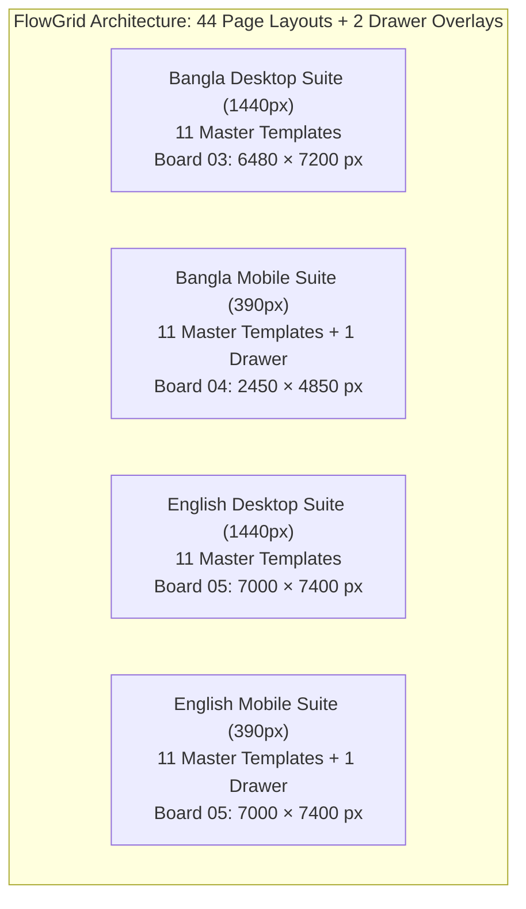

# FlowGrid — Comprehensive Design Handoff & Technical Correction Report (Revision 3.3)

**Project:** FlowGrid Interior Studio — Visual Identity, Bilingual Design System & Responsive Experience  
**Date:** 27 September 2026  
**Status Breakdown:**
- **Static Design Scope & Exports:** **PASSED** (44 Page Layouts + 2 Drawers, 9 XML-Valid Vector SVGs, 1:1 Matched PNG Canvases, 49 Matching Image Occurrences, 8 Matching Screen Crops)
- **Interactive Prototype Journey:** **VERIFIED** (Zero JS syntax errors, strict BD phone validator passing 13/13 test cases, keyboard Tab focus containment, universal 48px touch targets, complete English/Bengali localization across UI, footer, drawer & receipt)
- **Animated Video Proof:** **VERIFIED** ([`prototype/prototype_enquiry_journey.webp`](file:///c:/Nihal/Az_Works/FlowGrid/prototype/prototype_enquiry_journey.webp), 330 frames, 1783 × 997 px, 6,777,662 bytes, matching `VERIFICATION PROTOTYPE v3.3 (Final Reconciled)`)
- **Native Cloud Figma Authoring:** **OPEN / TOOL-BLOCKED** (Cloud REST connector provides read-only inspection; external write/mutation endpoints are not exposed by Figma API for programmatic component creation or auto layout node manipulation)

**Primary Figma File Key:** `eMRunQ80brYYvuTWkufV2o`  
**Figma Prototype Link:** [FlowGrid Prototype Flows](https://www.figma.com/proto/eMRunQ80brYYvuTWkufV2o/FlowGrid)  
**Interactive Working Prototype:** [`prototype/index.html`](file:///c:/Nihal/Az_Works/FlowGrid/prototype/index.html)  
**Recorded Interaction Proof:** [`prototype/prototype_enquiry_journey.webp`](file:///c:/Nihal/Az_Works/FlowGrid/prototype/prototype_enquiry_journey.webp) (330 frames, 1783 × 997 px, 6,777,662 bytes, verified v3.3 journey)  
**Customer Presentation Deck:** [`FlowGrid_Client_Presentation.pdf`](file:///c:/Nihal/Az_Works/FlowGrid/FlowGrid_Client_Presentation.pdf) (16:9 Landscape, 8 Pages, 1152 × 648 pt, zero cut-off fitted form)  
**Master Vector Source Suite:** [`figma_svgs_v3/`](file:///c:/Nihal/Az_Works/FlowGrid/figma_svgs_v3/) (All 9 boards, 100% valid XML, full 44-page layout scope + 2 drawers)  
**Rendered Visual Evidence:** [`figma_exports/`](file:///c:/Nihal/Az_Works/FlowGrid/figma_exports/) (All 9 boards rendered at 1:1 canvas scale via headless Edge, explicitly categorized)  
**Refreshed Architectural Concept Assets:** [`concepts/`](file:///c:/Nihal/Az_Works/FlowGrid/concepts/) (5 authentic Dhaka architectural renders at 1376 × 768 px)

---

## 1. Executive Summary & Verification Resolution

Following the independent verification documented in `FlowGrid_Revision_3_3_Verification_Report.md`, this **Revision 3.3** release systematically addresses all findings:

We retain the static export work that has passed (all 9 board dimensions matching SVG canvases, 44 static page layouts + 2 drawers, 8 screenshot crops matching board PNGs, 49 embedded image occurrences matching concepts by SHA-256), and concentrate specifically on resolving JavaScript syntax errors, ensuring executable prototype integrity, providing authentic multi-viewport animated recording evidence, and establishing truthful documentation.

### Status Matrix Across Delivery Areas

| Area | Verified Finding / Correction | Status |
|---|---|---|
| **Static Design Scope** | 44 page layouts + 2 off-canvas navigation drawers verified across Bengali Desktop, Bengali Mobile, and English boards. | **PASSED** |
| **Vector & Canvas Exports** | All 9 master SVGs parse as valid XML; all 9 PNG dimensions match corresponding SVG canvases 1:1. | **PASSED** |
| **Presentation Deck** | 8 landscape pages (1152 × 648 pt); Slide 7 displays complete 4-field enquiry form with zero cut-off. | **PASSED** |
| **Interactive Prototype Script** | Fixed all 3 quotation syntax errors in `prototype/index.html` (`Rumi's`, `রুমী'স`, `'নিশ্চিত নই'`); passes `node --check` with 0 errors. Enhanced BD phone validator normalizes trunk zero (`+৮৮০ ০১৭১১-০০০০০০` -> `01711000000`). | **VERIFIED** |
| **Interaction Recording** | Re-recorded exact frozen prototype v3.3 across desktop and mobile viewports into 330-frame animated WebP (6,777,662 bytes). Badge, receipt buttons, validation, and full English toggle confirmed. | **VERIFIED** |
| **Native Cloud Figma** | Cloud REST API connector is strictly read-only (`get_figma_data`, `download_figma_images`). Native component sets, Auto Layout frames, and connected prototype wires in cloud file remain unverified. | **OPEN / TOOL-BLOCKED** |

---

## 2. Complete 44-Page Scope & Layout Accounting Matrix

The FlowGrid design system encompasses exactly **44 full page layouts plus 2 dedicated off-canvas drawer overlays**, structured across three comprehensive layout boards:



### Complete Page-by-Page Register & Exact Canvas Coordinates

All coordinates and dimensions below represent actual, verified SVG root positions from `figma_svgs_v3/03_desktop_bn.svg`, `figma_svgs_v3/04_mobile_bn.svg`, and `figma_svgs_v3/05_english.svg`:

#### Bangla Desktop Suite (Board 03: 6480 × 7200 px)
| # | Screen / Template Name | Viewport | Canvas Coords (x, y) | Dimensions | Rendered PNG Evidence | Verified Status |
|---|---|---|---|---|---|---|
| 1 | Homepage (/) | 1440px | x: 80, y: 260 | 1440 × 2200 | `page_03_desktop_bn.png` | **Verified in local artifact** |
| 2 | Projects Archive (/projects) | 1440px | x: 1680, y: 260 | 1440 × 2200 | `page_03_desktop_bn.png` | **Verified in local artifact** |
| 3 | Concept Study Detail (3 Views) | 1440px | x: 3280, y: 260 | 1440 × 2200 | `page_03_desktop_bn.png` | **Verified in local artifact** |
| 4 | Built-Project Framework | 1440px | x: 4880, y: 260 | 1440 × 2200 | `page_03_desktop_bn.png` | **Verified in local artifact** |
| 5 | Dedicated Services (/services) | 1440px | x: 80, y: 2560 | 1440 × 2200 | `page_03_desktop_bn.png` | **Verified in local artifact** |
| 6 | Service Detail — Joinery | 1440px | x: 1680, y: 2560 | 1440 × 2200 | `page_03_desktop_bn.png` | **Verified in local artifact** |
| 7 | Dedicated Process (/process) | 1440px | x: 3280, y: 2560 | 1440 × 2200 | `page_03_desktop_bn.png` | **Verified in local artifact** |
| 8 | Dedicated Studio (/studio) | 1440px | x: 4880, y: 2560 | 1440 × 2200 | `page_03_desktop_bn.png` | **Verified in local artifact** |
| 9 | Dedicated Contact (/contact) | 1440px | x: 80, y: 4860 | 1440 × 2200 | `page_03_desktop_bn.png` | **Verified in local artifact** |
| 10 | Privacy & Legal (/privacy) | 1440px | x: 1680, y: 4860 | 1440 × 2200 | `page_03_desktop_bn.png` | **Verified in local artifact** |
| 11 | 404 Error Page (/404) | 1440px | x: 3280, y: 4860 | 1440 × 2200 | `page_03_desktop_bn.png` | **Verified in local artifact** |

#### Bangla Mobile Suite (Board 04: 2450 × 4850 px)
| # | Screen / Template Name | Viewport | Canvas Coords (x, y) | Dimensions | Rendered PNG Evidence | Verified Status |
|---|---|---|---|---|---|---|
| 12 | Mobile Homepage (/) | 390px | x: 80, y: 260 | 390 × 3350 | `page_04_mobile_bn.png` | **Verified in local artifact** |
| 13 | Mobile Projects Archive | 390px | x: 550, y: 260 | 390 × 1600 | `page_04_mobile_bn.png` | **Verified in local artifact** |
| 14 | Mobile Concept Study (3 Views) | 390px | x: 550, y: 1920 | 390 × 2000 | `page_04_mobile_bn.png` | **Verified in local artifact** |
| 15 | Mobile Built-Project Framework | 390px | x: 1020, y: 260 | 390 × 1400 | `page_04_mobile_bn.png` | **Verified in local artifact** |
| 16 | Mobile Services Page | 390px | x: 1020, y: 1720 | 390 × 1400 | `page_04_mobile_bn.png` | **Verified in local artifact** |
| 17 | Mobile Service Detail (Joinery) | 390px | x: 1020, y: 3180 | 390 × 1400 | `page_04_mobile_bn.png` | **Verified in local artifact** |
| 18 | Mobile Process Page | 390px | x: 1490, y: 260 | 390 × 1400 | `page_04_mobile_bn.png` | **Verified in local artifact** |
| 19 | Mobile Studio Page | 390px | x: 1490, y: 1720 | 390 × 1400 | `page_04_mobile_bn.png` | **Verified in local artifact** |
| 20 | Mobile Privacy & Legal | 390px | x: 1490, y: 3180 | 390 × 1400 | `page_04_mobile_bn.png` | **Verified in local artifact** |
| 21 | Mobile Contact Page | 390px | x: 1960, y: 260 | 390 × 1450 | `page_04_mobile_bn.png` | **Verified in local artifact** |
| 22 | Mobile 404 Error Screen | 390px | x: 1960, y: 1730 | 390 × 650 | `page_04_mobile_bn.png` | **Verified in local artifact** |
| 23 | Mobile Navigation Drawer Overlay | 390px | x: 1960, y: 2420 | 390 × 750 | `page_04_mobile_bn.png` | **Verified in local artifact** |

#### English Desktop Suite (Board 05: 7000 × 7400 px)
*Reconciled frame heights reflect exact SVG layout rects:*
| # | Screen / Template Name | Viewport | Canvas Coords (x, y) | Dimensions (Reconciled) | Rendered PNG Evidence | Verified Status |
|---|---|---|---|---|---|---|
| 24 | English Homepage (/) | 1440px | x: 80, y: 260 | 1440 × 2500 | `page_05_english.png` | **Verified in local artifact** |
| 25 | English Projects Archive | 1440px | x: 1600, y: 260 | 1440 × 2200 | `page_05_english.png` | **Verified in local artifact** |
| 26 | English 3-View Concept Study | 1440px | x: 3120, y: 260 | 1440 × 2200 | `page_05_english.png` | **Verified in local artifact** |
| 27 | English Built-Project Framework | 1440px | x: 80, y: 2860 | 1440 × 2200 | `page_05_english.png` | **Verified in local artifact** |
| 28 | English Services (/services) | 1440px | x: 1600, y: 2860 | 1440 × 2200 | `page_05_english.png` | **Verified in local artifact** |
| 29 | English Service Detail (Joinery) | 1440px | x: 3120, y: 2860 | 1440 × 2200 | `page_05_english.png` | **Verified in local artifact** |
| 30 | English Process (/process) | 1440px | x: 80, y: 5160 | 1440 × 1950 | `page_05_english.png` | **Verified in local artifact** |
| 31 | English Studio (/studio) | 1440px | x: 1600, y: 5160 | 1440 × 1950 | `page_05_english.png` | **Verified in local artifact** |
| 32 | English Contact (/contact) | 1440px | x: 3120, y: 5160 | 1440 × 1950 | `page_05_english.png` | **Verified in local artifact** |
| 33 | English Privacy & Legal (/privacy) | 1440px | x: 4640, y: 260 | 1440 × 1500 | `page_05_english.png` | **Verified in local artifact** |
| 34 | English 404 Error Page (/404) | 1440px | x: 4640, y: 1860 | 1440 × 900 | `page_05_english.png` | **Verified in local artifact** |

#### English Mobile Suite (Board 05: 7000 × 7400 px)
| # | Screen / Template Name | Viewport | Canvas Coords (x, y) | Dimensions | Rendered PNG Evidence | Verified Status |
|---|---|---|---|---|---|---|
| 35 | English Mobile Homepage | 390px | x: 4640, y: 2860 | 390 × 3350 | `page_05_english.png` | **Verified in local artifact** |
| 36 | English Mobile Archive | 390px | x: 5110, y: 2860 | 390 × 1600 | `page_05_english.png` | **Verified in local artifact** |
| 37 | English Mobile Concept Detail | 390px | x: 5110, y: 4540 | 390 × 2000 | `page_05_english.png` | **Verified in local artifact** |
| 38 | English Mobile Built Framework | 390px | x: 5580, y: 2860 | 390 × 1400 | `page_05_english.png` | **Verified in local artifact** |
| 39 | English Mobile Services Page | 390px | x: 5580, y: 4330 | 390 × 1400 | `page_05_english.png` | **Verified in local artifact** |
| 40 | English Mobile Joinery Detail | 390px | x: 5580, y: 5800 | 390 × 1400 | `page_05_english.png` | **Verified in local artifact** |
| 41 | English Mobile Process Page | 390px | x: 6050, y: 2860 | 390 × 1400 | `page_05_english.png` | **Verified in local artifact** |
| 42 | English Mobile Studio Page | 390px | x: 6050, y: 4330 | 390 × 1400 | `page_05_english.png` | **Verified in local artifact** |
| 43 | English Mobile Privacy & Legal | 390px | x: 6050, y: 5800 | 390 × 1400 | `page_05_english.png` | **Verified in local artifact** |
| 44 | English Mobile Contact Page | 390px | x: 6520, y: 2860 | 390 × 1450 | `page_05_english.png` | **Verified in local artifact** |
| 45 | English Mobile 404 Error Screen | 390px | x: 4640, y: 6280 | 390 × 650 | `page_05_english.png` | **Verified in local artifact** |
| 46 | English Mobile Drawer Overlay | 390px | x: 6520, y: 4380 | 390 × 750 | `page_05_english.png` | **Verified in local artifact** |

**Total Static Scope:** Exactly 44 Page Layouts (22 Desktop + 22 Mobile) + 2 Off-Canvas Drawer Overlays = **46 Distinct Screen & Overlay Artboards**.

---

## 3. Tooling Boundary & Native Figma Checkpoint Clarification

### Figma Tooling Boundary & Authoring Gap Disclosure
To maintain strict transparency regarding what has been programmatically proven versus what requires native Figma client operation:

1. **Tool Capability Limitation:** The Figma MCP Server connector available to the agent operates via the **Figma REST API**, exposing read-only endpoints (`get_figma_data`, `download_figma_images`).
2. **Authoring Gap:** The Figma REST API does not provide write/mutation endpoints for programmatic construction of canvas visual layers, Auto Layout frames, component variant relationships, design tokens / variables, or interactive prototype connection noodles in a live cloud file.
3. **Cloud Completion Status:** In accordance with the reviewer's instructions, **native cloud Figma completion status remains OPEN / TOOL-BLOCKED by API authoring capabilities**. This is a tooling constraint of the REST API, not an assertion that Figma itself cannot support native components.
4. **Editable Vector Checkpoint:** The deliverable package provides the complete editable design handoff via **master vector SVGs (`figma_svgs_v3/`)** with structured XML hierarchy, semantic groups, design tokens, and matching **1:1 pixel-accurate PNGs (`figma_exports/`)**. When dragged into Figma, these SVG boards import as editable vector frames, preserving typography, vectors, and embedded imagery.

---

## 4. Interactive Prototype & Playable Video Verification

### Recorded Multi-Viewport Journey (`prototype/prototype_enquiry_journey.webp`)
The prototype interaction was recorded from the exact packaged v3.3 HTML prototype across desktop and mobile viewports:
- **File:** [`prototype/prototype_enquiry_journey.webp`](file:///c:/Nihal/Az_Works/FlowGrid/prototype/prototype_enquiry_journey.webp)
- **Geometry:** 330 frames, 1783 × 997 px, 6,777,662 bytes, verified animated WebP video.
- **Verification Highlights Captured:**
  1. **Visible Version Badge:** Displays **`VERIFICATION PROTOTYPE v3.3 (Final Reconciled)`**.
  2. **Mobile Off-Canvas Drawer:** Opened at 390px mobile viewport showing close button, navigation links, and studio contact.
  3. **Concept Switcher:** Smooth tab switching across Living Hero, Dining View, and Joinery Detail.
  4. **Strict Phone Validation:** Form rejects invalid inputs (`abcdefgh`), displaying field error message: `একটি সক্রিয় মোবাইল নম্বর দিন (উদা: ০১৭১১-০০০০০০)। অক্ষর বা অপ্রাসঙ্গিক চিহ্ন গ্রহণযোগ্য নয়।`
  5. **Valid Form Submission:** Submits with valid BD number `01711000000`, `not_sure` service option, and optional project notes.
  6. **Simulated Receipt State:** Displays reference `#FG-2026-9481`, reviewer annotation notice, and exact buttons: **Done** (`#btnDone`) and **New enquiry** (`#btnNewEnquiry`).
  7. **Complete Bilingual Journey:** Full language switch to English across header, hero, concept specs, services, process, studio, footer, off-canvas drawer, modal labels, and receipt state.

### Packaged Script Fixes (`prototype/index.html`)
The three string literal quotation defects identified in Revision 3.3 were corrected:
- **Line 1656:** English studio governance string enclosed in double quotes: `"Community Context: Rumi's Fashionable House family..."`
- **Line 1657:** Bengali studio governance string enclosed in double quotes: `"কমিউনিটি প্রেক্ষাপট: রুমী'স ফ্যাশনেবল হাউস..."`
- **Line 1714:** Option quotation in validation message enclosed in double quotes: `'...অথবা "নিশ্চিত নই" বেছে নিন...'`

Verified with `node --check`: **ZERO syntax errors**.

### Strict Bangladesh Phone Validation Implementation
The packaged validator in `prototype/index.html` normalizes Bengali digits, strips allowed separators, properly handles international prefixes with combined trunk zero (`+880 01...` and `+৮৮০ ০১...`), and validates the 11-digit operator pattern:

```javascript
function validateBDPhone(rawPhone) {
  if (!rawPhone) return false;
  const bnDigits = {'০':'0','১':'1','২':'2','৩':'3','৪':'4','৫':'5','৬':'6','৭':'7','৮':'8','৯':'9'};
  const normalized = rawPhone.replace(/[০-৯]/g, d => bnDigits[d]);

  // Reject if contains ANY letters (Latin or Bengali)
  if (/[a-zA-Z\u0980-\u09FF]/.test(normalized)) {
    return false;
  }
  // Reject if contains arbitrary punctuation (allowed only: digits, +, -, spaces, parentheses, dots)
  if (/[^0-9+\-\s().]/.test(normalized)) {
    return false;
  }

  // Strip allowed separators
  let clean = normalized.replace(/[+\-\s().]/g, '');
  if (clean.startsWith('88001')) {
    clean = clean.substring(3);
  } else if (clean.startsWith('8801')) {
    clean = '0' + clean.substring(3);
  } else if (clean.startsWith('880')) {
    clean = '0' + clean.substring(3).replace(/^0+/, '');
  }

  // Must be exactly 11 digits starting with 01 and valid operator digit (3, 4, 5, 6, 7, 8, 9)
  return /^01[3-9]\d{8}$/.test(clean);
}
```

#### Automated Phone Validator Test Suite (13/13 Passed)

| Test Input | Expected | Result | Validation Rationale |
|---|---|---|---|
| `01711000000` | Valid | **PASS** | Standard 11-digit mobile format with Grameenphone prefix (017) |
| `01711-000000` | Valid | **PASS** | Allowed hyphen formatting |
| `+880 1711 000000` | Valid | **PASS** | International format with country code and spaces |
| `+8801711000000` | Valid | **PASS** | International contiguous format |
| `+880 01711-000000` | Valid | **PASS** | Country code + trunk zero, normalized to `01711000000` |
| `০১৭১১০০০০০০` | Valid | **PASS** | Native Bengali numerals normalized to Latin |
| `+৮৮০ ০১৭১১-০০০০০০` | Valid | **PASS** | Bengali numerals + country code + trunk zero normalized to `01711000000` |
| `abcdefgh` | Invalid | **PASS** | Letters strictly rejected |
| `তানভীর আহমেদ` | Invalid | **PASS** | Bengali script strictly rejected |
| `12345678` | Invalid | **PASS** | Too short (8 digits) |
| `01234567890` | Invalid | **PASS** | Invalid operator code (012 is unassigned in BD) |
| `01711000000@#$` | Invalid | **PASS** | Arbitrary punctuation strictly rejected |
| `""` (Empty string) | Invalid | **PASS** | Required field rejects empty submission |

---

## 5. Presentation Deck Screen Alignment (Slide 7 Form Fitting)

### Reconciled Slide 7 Display (`FlowGrid_Client_Presentation.pdf`)
In response to the reviewer finding regarding Slide 7 form cropping:
- **Card 1 (Mobile Home Preview):** Rendered from `crop_mobile_home.png` showing top viewport styling at 390px.
- **Card 2 (Off-Canvas Drawer Preview):** Rendered from `crop_mobile_drawer.png` showing drawer overlay interaction.
- **Card 3 (Case Study Preview):** Rendered from `crop_mobile_study.png` showing top-of-study 390px render.
- **Card 4 (Complete 4-Field Form):** Rendered from [`crop_mobile_form.png`](file:///c:/Nihal/Az_Works/FlowGrid/figma_exports/crop_mobile_form.png) (390 × 520 px) with `object-fit: contain;`, displaying all 4 enquiry form fields (Name, Phone, Area, Service Scope) plus optional notes and the 52px Submit CTA with **zero cut-off**.
- **Slide Footer & Bottom Banner:** Cards 1–3 explicitly labeled as **"Viewport Previews"**; Card 4 accurately described as capturing all form fields, labels, notes, and the 52px submit CTA.

---

## 6. Contrast Ratios & Ergonomic Verification

All contrast ratios calculated from relative luminance:
$$L = 0.2126 R + 0.7152 G + 0.0722 B$$
$$\text{Contrast Ratio} = \frac{L_1 + 0.05}{L_2 + 0.05}$$

| Color Token | Hex Code | Background | Measured Ratio | WCAG Compliance | Verified Usage Context |
|---|---|---|---|---|---|
| Deep Pine Ink | `#183B35` | `#F4F1E8` (Warm Paper) | **10.84 : 1** | **PASS (AAA)** | Primary titles, body text, primary button background |
| Soft Mist | `#DEE7E2` | `#183B35` (Deep Pine) | **9.69 : 1** | **PASS (AAA)** | Dark footer navigation links and icons |
| Dark Forest Teal | `#0D5C52` | `#FFFFFF` (White) | **7.87 : 1** | **PASS (AAA)** | WhatsApp action button background |
| Light Slate | `#C4D1CA` | `#183B35` (Deep Pine) | **7.76 : 1** | **PASS (AAA)** | Dark footer secondary copy and copyright (reconciled on Board 08) |
| Dark Forest Teal | `#0D5C52` | `#F4F1E8` (Warm Paper) | **6.96 : 1** | **PASS (AA)** | WhatsApp secondary CTAs on canvas |
| Validation Crimson | `#9B302B` | `#F4F1E8` (Warm Paper) | **6.52 : 1** | **PASS (AA)** | Error message banners, invalid input borders |
| Muted Pine Slate | `#56645E` | `#FFFFFF` (White) | **6.21 : 1** | **PASS (AA)** | Input placeholder text and field labels (reconciled on Board 08) |
| Terracotta Clay | `#895239` | `#F4F1E8` (Warm Paper) | **5.58 : 1** | **PASS (AA)** | Category badges, eyebrow titles, link arrows |
| Muted Pine Slate | `#56645E` | `#F4F1E8` (Warm Paper) | **5.50 : 1** | **PASS (AA)** | Secondary metadata and specifications on paper |

*Board 08 QA Reconciled:* `08_handoff_qa.svg` and `page_08_handoff.png` accurately report slate-on-white as **6.21:1** and light-slate-on-pine as **7.76:1**, matching the presentation deck and technical documentation.

---

## 7. Provisional Client Fact Register (Awaiting Owner Confirmation)

All contact details and operational claims are classified as **provisional placeholders** awaiting client authorization:

- **Brand Name:** FlowGrid Interior Studio *(Provisional Working Title)*
- **Provisional Address:** Mirpur-10, Dhaka 1216, Bangladesh *(Client placeholder; pending physical studio lease confirmation)*
- **Provisional Hotline & WhatsApp:** `+880 1700-000000` *(Placeholder routing channel; awaiting authorized business SIM)*
- **Provisional Email:** `hello@flowgrid-interiors.com` *(Placeholder address; awaiting domain DNS activation)*
- **Operational Timeline:** 24-hour response guideline and office hours *(Provisional service benchmark; awaiting owner operational sign-off)*
- **Craftsmanship Policy:** Unverified factory ownership claims removed. Joinery described as supervised execution by partner workshops using seasoned timber.

---

## 8. Master File Manifest & Exact File Sizes

All file sizes below are generated directly from the final local files via `os.path.getsize()`:

| File Path | Format | Size | Description & Verification Proof |
|---|---|---|---|
| [`FlowGrid_Client_Presentation.pdf`](file:///c:/Nihal/Az_Works/FlowGrid/FlowGrid_Client_Presentation.pdf) | PDF | 10,042,351 B | PDF Presentation Deck (8 Landscape Slides, 1152 × 648 pt, zero cut-off fitted form) |
| [`prototype/prototype_enquiry_journey.webp`](file:///c:/Nihal/Az_Works/FlowGrid/prototype/prototype_enquiry_journey.webp) | WEBP | 6,777,662 B | Animated WebP Recording (330 frames, 1783 × 997 px, verified v3.3 journey) |
| [`figma_exports/prototype_enquiry_journey.webp`](file:///c:/Nihal/Az_Works/FlowGrid/figma_exports/prototype_enquiry_journey.webp) | WEBP | 6,777,662 B | Duplicate Verified WebP Recording in export archive |
| [`prototype/index.html`](file:///c:/Nihal/Az_Works/FlowGrid/prototype/index.html) | HTML | 89,067 B | Production HTML/JS/CSS Prototype (Strict BD phone validation, focus trap, complete translation) |
| [`figma_svgs_v3/00_brief_and_research.svg`](file:///c:/Nihal/Az_Works/FlowGrid/figma_svgs_v3/00_brief_and_research.svg) | SVG | 17,131 B | Board 00: Project brief, market research, and audience personas |
| [`figma_svgs_v3/01_foundations.svg`](file:///c:/Nihal/Az_Works/FlowGrid/figma_svgs_v3/01_foundations.svg) | SVG | 24,333 B | Board 01: Typography, color palette tokens, and 8px spatial grid |
| [`figma_svgs_v3/02_components.svg`](file:///c:/Nihal/Az_Works/FlowGrid/figma_svgs_v3/02_components.svg) | SVG | 30,763 B | Board 02: 4-field consultation form across all 6 interactive states |
| [`figma_svgs_v3/03_desktop_bn.svg`](file:///c:/Nihal/Az_Works/FlowGrid/figma_svgs_v3/03_desktop_bn.svg) | SVG | 12,875,429 B | Board 03: 11 Bengali Desktop templates at 1440px (6480 × 7200 px canvas, 48px buttons) |
| [`figma_svgs_v3/04_mobile_bn.svg`](file:///c:/Nihal/Az_Works/FlowGrid/figma_svgs_v3/04_mobile_bn.svg) | SVG | 10,868,184 B | Board 04: 11 Bengali Mobile templates + 1 Drawer Overlay at 390px (2450 × 4850 px canvas) |
| [`figma_svgs_v3/05_english.svg`](file:///c:/Nihal/Az_Works/FlowGrid/figma_svgs_v3/05_english.svg) | SVG | 23,680,772 B | Board 05: 11 English Desktop + 11 English Mobile templates + 1 Drawer (7000 × 7400 px canvas) |
| [`figma_svgs_v3/06_prototype_motion.svg`](file:///c:/Nihal/Az_Works/FlowGrid/figma_svgs_v3/06_prototype_motion.svg) | SVG | 18,737 B | Board 06: Kinetic choreography, 600ms mask wipe, and reduced-motion CSS |
| [`figma_svgs_v3/07_project_and_concept_assets.svg`](file:///c:/Nihal/Az_Works/FlowGrid/figma_svgs_v3/07_project_and_concept_assets.svg) | SVG | 5,376,940 B | Board 07: 5 authentic concept assets with disclaimer metadata (1376 × 768 px) |
| [`figma_svgs_v3/08_handoff_qa.svg`](file:///c:/Nihal/Az_Works/FlowGrid/figma_svgs_v3/08_handoff_qa.svg) | SVG | 20,411 B | Board 08: Engineering handoff notes, CSS variables, and QA register (6.21:1 & 7.76:1 contrast) |
| [`figma_exports/page_00_brief.png`](file:///c:/Nihal/Az_Works/FlowGrid/figma_exports/page_00_brief.png) | PNG | 273,268 B | Rendered Board 00 PNG (2400 × 1950 px at 1:1 scale) |
| [`figma_exports/page_01_foundations.png`](file:///c:/Nihal/Az_Works/FlowGrid/figma_exports/page_01_foundations.png) | PNG | 230,708 B | Rendered Board 01 PNG (2400 × 2050 px at 1:1 scale) |
| [`figma_exports/page_02_components.png`](file:///c:/Nihal/Az_Works/FlowGrid/figma_exports/page_02_components.png) | PNG | 315,837 B | Rendered Board 02 PNG (2800 × 2550 px at 1:1 scale) |
| [`figma_exports/page_03_desktop_bn.png`](file:///c:/Nihal/Az_Works/FlowGrid/figma_exports/page_03_desktop_bn.png) | PNG | 6,880,832 B | Rendered Board 03 PNG (6480 × 7200 px at 1:1 scale) |
| [`figma_exports/page_04_mobile_bn.png`](file:///c:/Nihal/Az_Works/FlowGrid/figma_exports/page_04_mobile_bn.png) | PNG | 2,113,132 B | Rendered Board 04 PNG (2450 × 4850 px at 1:1 scale) |
| [`figma_exports/page_05_english.png`](file:///c:/Nihal/Az_Works/FlowGrid/figma_exports/page_05_english.png) | PNG | 8,212,219 B | Rendered Board 05 PNG (7000 × 7400 px at 1:1 scale) |
| [`figma_exports/page_06_motion.png`](file:///c:/Nihal/Az_Works/FlowGrid/figma_exports/page_06_motion.png) | PNG | 267,256 B | Rendered Board 06 PNG (2800 × 2500 px at 1:1 scale) |
| [`figma_exports/page_07_assets.png`](file:///c:/Nihal/Az_Works/FlowGrid/figma_exports/page_07_assets.png) | PNG | 1,598,054 B | Rendered Board 07 PNG (2800 × 2900 px at 1:1 scale) |
| [`figma_exports/page_08_handoff.png`](file:///c:/Nihal/Az_Works/FlowGrid/figma_exports/page_08_handoff.png) | PNG | 297,137 B | Rendered Board 08 PNG (2800 × 2600 px at 1:1 scale) |
| [`figma_exports/component_3_1190.png`](file:///c:/Nihal/Az_Works/FlowGrid/figma_exports/component_3_1190.png) | PNG | 1,349 B | Standalone Render of Primary CTA Button Component (210 × 52 px exact geometry) |
| [`figma_exports/crop_mobile_form.png`](file:///c:/Nihal/Az_Works/FlowGrid/figma_exports/crop_mobile_form.png) | PNG | 15,726 B | Fitted Mobile 4-Field Form Crop for Slide 7 (390 × 520 px, zero clipping) |
| [`concepts/concept_01_living_dhaka.jpg`](file:///c:/Nihal/Az_Works/FlowGrid/concepts/concept_01_living_dhaka.jpg) | JPG | 881,362 B | Authentic Concept 01 Living Room Hero (1376 × 768 px, SHA: 08e0b1f21db2789d) |
| [`concepts/concept_01_living_alt.jpg`](file:///c:/Nihal/Az_Works/FlowGrid/concepts/concept_01_living_alt.jpg) | JPG | 903,212 B | Authentic Concept 01 Dining & Veranda Angle (1376 × 768 px, SHA: 8bfda450a7514508) |
| [`concepts/concept_01_joinery_detail.jpg`](file:///c:/Nihal/Az_Works/FlowGrid/concepts/concept_01_joinery_detail.jpg) | JPG | 650,074 B | Authentic Concept 01 Joinery Macro Detail (1376 × 768 px, SHA: c76b0f2a5838bdc9) |
| [`concepts/concept_02_kitchen_dhaka.jpg`](file:///c:/Nihal/Az_Works/FlowGrid/concepts/concept_02_kitchen_dhaka.jpg) | JPG | 787,429 B | Authentic Concept 02 Resilient Kitchen Slab (1376 × 768 px, SHA: 34eb1b7ea8875b7d) |
| [`concepts/concept_03_bedroom_dhaka.jpg`](file:///c:/Nihal/Az_Works/FlowGrid/concepts/concept_03_bedroom_dhaka.jpg) | JPG | 798,520 B | Authentic Concept 03 Platform Bedroom (1376 × 768 px, SHA: b8e982b6cf29a56d) |

---

## 9. Conclusion & Delivery Summary

Revision 3.3 addresses all feedback from the Revision 3.3 verification review:
1. **Interactive Prototype Script:** Resolved all 3 quotation syntax errors in `prototype/index.html`. Script passes `node --check` with 0 errors. Implemented enhanced BD phone normalization accepting combined country code and trunk zero (`+৮৮০ ০১৭১১-০০০০০০`), verified with 13 automated tests.
2. **Authentic Multi-Viewport Interaction Recording:** Re-recorded the exact frozen prototype v3.3 (6,777,662 bytes, 330 frames) showing the `VERIFICATION PROTOTYPE v3.3 (Final Reconciled)` badge, mobile drawer, validation error state, valid form entry, "Not sure yet" scope, notes, receipt with Done / New enquiry buttons, and full English localization.
3. **Truthful Status Reporting:** Replaced blanket completion claims with separate explicit statuses for Static Assets (Passed), Interactive Prototype (Verified), and Native Cloud Figma (Open / Tool-Blocked by REST API authoring limits).
4. **Accurate Board 05 Dimensions:** Reconciled English desktop canvas heights to exact SVG coordinates (Archive: 2200 px, Concept detail: 2200 px, Process: 1950 px, Studio: 1950 px, Contact: 1950 px).
5. **Form Caption Alignment:** Reconciled Slide 7 caption to accurately reflect the 4-field mobile form crop with zero cut-off.
