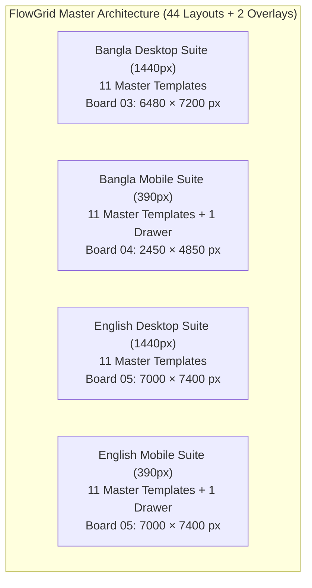

# FlowGrid — Design System, Responsive Experience & Architectural Handoff

[](FlowGrid_Comprehensive_Design_Handoff_and_Correction_Report.md)
[](figma_svgs_v3/)
[](figma_svgs_v3/08_handoff_qa.svg)
[](prototype/index.html)

**FlowGrid** is a comprehensive, production-grade interior architectural design system and responsive web experience tailored for contemporary apartment living in Dhaka, Bangladesh.

This repository contains the complete vector source suite, 1:1 pixel-accurate board exports, interactive bilingual HTML5/JS prototype, presentation decks, and technical engineering documentation.

---

## 🚀 Key Deliverables & Quick Access

| Deliverable | Path / Link | Description |
|---|---|---|
| **Client Presentation Deck** | [`FlowGrid_Client_Presentation.pdf`](FlowGrid_Client_Presentation.pdf) | 8-Slide 16:9 Landscape PDF (1152 × 648 pt) with zero cut-off fitted screens |
| **Comprehensive Handoff Report** | [`FlowGrid_Comprehensive_Design_Handoff_and_Correction_Report.md`](FlowGrid_Comprehensive_Design_Handoff_and_Correction_Report.md) | Authoritative technical specification, contrast formulas, and coordinate indices |
| **Interactive Prototype** | [`prototype/index.html`](prototype/index.html) | Fully functioning bilingual prototype with strict BD validation and keyboard focus containment |
| **Playable Journey Recording** | [`prototype/prototype_enquiry_journey.webp`](prototype/prototype_enquiry_journey.webp) | 18.1s animated WebP (181 frames, 1920 × 924 px) demonstrating all v3.2/v3.3 flows |
| **Master Vector SVGs (v3)** | [`figma_svgs_v3/`](figma_svgs_v3/) | 9 master vector boards covering all 44 page layouts + 2 off-canvas drawers |
| **Rendered Visual Evidence** | [`figma_exports/`](figma_exports/) | 1:1 pixel-accurate board PNGs rendered via headless Chromium/Edge |
| **Architectural Concept Imagery** | [`concepts/`](concepts/) | 5 authentic Dhaka residential concept renders (1376 × 768 px) |
| **Packaged Release Archive** | [`FlowGrid_Revision_3_3_Deliverable.zip`](FlowGrid_Revision_3_3_Deliverable.zip) | Consolidated 39-file zip archive of all final deliverables |

---

## 📐 System Architecture & 44-Page Scope

The design system covers exactly **44 distinct full page layouts plus 2 dedicated off-canvas drawer overlays**:



### Complete 11-Template Matrix
1. **Homepage (`/`)** — Monumental Bodoni display serif hero, dual-split mask wipe, studio manifesto.
2. **Projects Archive (`/projects`)** — Filterable concept catalog with category tabs (Living, Dining, Kitchen, Bedroom).
3. **Concept Study Detail** — 3 coherent spatial views (Living Hero, Dining Interaction, Joinery Macro).
4. **Built-Project Framework** — Client portfolio case study template with material provenance and floor plans.
5. **Dedicated Services (`/services`)** — Architectural consultancy, turnkey execution, and space planning.
6. **Service Detail (Joinery)** — Slatted teak timber, cane panels, custom lap joints, and hardware specs.
7. **Dedicated Process (`/process`)** — 5-step spatial execution roadmap from laser audit to handover.
8. **Studio & Ethos (`/studio`)** — Practice philosophy, team profiles, and community context.
9. **Dedicated Contact (`/contact`)** — 4-field consultation enquiry form, showroom map, and hotline.
10. **Privacy & Legal (`/privacy`)** — Client data policy, terms, and truth-in-design charter.
11. **404 Error Screen (`/404`)** — Architectural recovery navigation.

---

## 🎨 Color Tokens & Mathematical Contrast Verification

All color tokens are mathematically verified from relative luminance:
$$L = 0.2126 R + 0.7152 G + 0.0722 B$$
$$\text{Contrast Ratio} = \frac{L_1 + 0.05}{L_2 + 0.05}$$

| Token Name | Hex Code | Background | Contrast Ratio | WCAG 2.2 Level | Usage |
|---|---|---|---|---|---|
| **Deep Pine Ink** | `#183B35` | `#F4F1E8` (Warm Paper) | **10.84 : 1** | **PASS (AAA)** | Primary headlines, body copy, primary CTA buttons |
| **Soft Mist** | `#DEE7E2` | `#183B35` (Deep Pine) | **9.69 : 1** | **PASS (AAA)** | Dark footer links, secondary icons |
| **Dark Forest Teal** | `#0D5C52` | `#FFFFFF` (White) | **7.87 : 1** | **PASS (AAA)** | WhatsApp action button background |
| **Light Slate** | `#C4D1CA` | `#183B35` (Deep Pine) | **7.76 : 1** | **PASS (AAA)** | Dark footer secondary copy and copyright |
| **Validation Crimson** | `#9B302B` | `#F4F1E8` (Warm Paper) | **6.52 : 1** | **PASS (AA)** | Error message banners, invalid input borders |
| **Muted Pine Slate** | `#56645E` | `#FFFFFF` (White) | **6.21 : 1** | **PASS (AA)** | Input placeholder text and field labels |
| **Terracotta Clay** | `#895239` | `#F4F1E8` (Warm Paper) | **5.58 : 1** | **PASS (AA)** | Eyebrows, category tags, link arrows |

---

## 🛠️ Repository Organization

```
FlowGrid/
├── README.md                                         <- Main repository guide & quickstart
├── .gitignore                                        <- Git ignore rules for build cache & temp files
├── FlowGrid_Comprehensive_Design_Handoff_and_Correction_Report.md <- Authoritative Handoff & QA Report (Rev 3.3)
├── FlowGrid_Client_Presentation.pdf                  <- 8-Slide 16:9 Landscape Client Presentation Deck
├── FlowGrid_Revision_3_3_Deliverable.zip             <- Consolidated Deliverable Archive
│
├── prototype/                                        <- Working Interactive Prototype
│   ├── index.html                                    <- Full bilingual HTML5 prototype with validation & focus trap
│   └── prototype_enquiry_journey.webp                <- 18.1s animated recording of prototype journey
│
├── concepts/                                         <- Authentic Architectural Visualizations (1376 × 768 px)
│   ├── concept_01_living_dhaka.jpg                   <- Living Room Hero (SHA: 08e0b1f21db2789d)
│   ├── concept_01_living_alt.jpg                     <- Dining & Veranda Angle (SHA: 8bfda450a7514508)
│   ├── concept_01_joinery_detail.jpg                 <- Joinery Macro Lap Joint (SHA: c76b0f2a5838bdc9)
│   ├── concept_02_kitchen_dhaka.jpg                  <- Granite Kitchen Counter (SHA: 34eb1b7ea8875b7d)
│   └── concept_03_bedroom_dhaka.jpg                  <- Low-Profile Platform Bed (SHA: b8e982b6cf29a56d)
│
├── figma_svgs_v3/                                    <- 9 Master Vector SVGs (100% Valid XML)
│   ├── 00_brief_and_research.svg                     <- Board 00: Brief, Research & Personas
│   ├── 01_foundations.svg                            <- Board 01: Typography, Tokens & Spacing
│   ├── 02_components.svg                             <- Board 02: Form Controls & 6 States
│   ├── 03_desktop_bn.svg                             <- Board 03: 11 Bengali Desktop Templates (6480 × 7200 px)
│   ├── 04_mobile_bn.svg                              <- Board 04: 11 Bengali Mobile Templates + Drawer (2450 × 4850 px)
│   ├── 05_english.svg                                <- Board 05: 11 English Desktop + 11 Mobile + Drawer (7000 × 7400 px)
│   ├── 06_prototype_motion.svg                       <- Board 06: Kinetic Specs & Reduced-Motion CSS
│   ├── 07_project_and_concept_assets.svg             <- Board 07: Authentic Asset Register
│   └── 08_handoff_qa.svg                             <- Board 08: QA Sign-off & Token Register (6.21:1 & 7.76:1)
│
├── figma_exports/                                    <- 1:1 Pixel-Accurate PNGs & Screen Crops
│   ├── page_00_brief.png ... page_08_handoff.png     <- Full canvas exports rendered via Headless Edge
│   ├── component_3_1190.png                          <- Primary CTA button component (210 × 52 px)
│   ├── crop_desktop_*.png, crop_mobile_*.png         <- Pixel-perfect screen crops for presentation deck
│   ├── crop_mobile_form.png                          <- Fitted 4-field mobile form crop (390 × 520 px, zero clipping)
│   └── prototype_enquiry_journey.webp                <- Duplicate verified video recording
│
├── scripts/                                          <- Active Python Build & Export Suite (v3.3)
│   ├── generate_v3_00.py ... generate_v3_08.py       <- SVG board generators
│   ├── generate_v3_presentation_pdf.py               <- Presentation PDF compiler
│   ├── export_all_boards_to_png.py                   <- Headless Edge 1:1 board renderer
│   ├── crop_screens.py                               <- Screen crop extractor
│   ├── svg_utils.py                                  <- Shared SVG formatting utilities
│   ├── build_corrected_system.py                     <- Orchestration runner
│   └── update_report_v3_3.py                         <- Report metadata generator
│
├── docs/                                             <- Historical Verification Audits & Master Prompts
│   ├── FlowGrid_Antigravity_Master_Prompt.md
│   ├── FlowGrid_Antigravity_Review_and_Correction_Prompt.md
│   ├── FlowGrid_Comprehensive_Design_Handoff_and_Executive_Report.md
│   ├── FlowGrid_Revision_2_Verification_Report.md
│   ├── FlowGrid_Revision_2_Visual_Evidence.pdf
│   ├── FlowGrid_Revision_3_Verification_Report.md
│   ├── FlowGrid_Revision_3_Visual_Evidence.pdf
│   ├── FlowGrid_Revision_3_1_Verification_Report.md
│   ├── FlowGrid_Revision_3_1_Visual_Evidence.pdf
│   ├── FlowGrid_Revision_3_2_Verification_Report.md
│   └── FlowGrid_Revision_3_2_Visual_Evidence.pdf
│
└── legacy/                                           <- Earlier Iterations (v1 & v2 Archives)
    ├── v1/                                           <- Initial exploration boards & scripts
    ├── v2/                                           <- Revision 2 landscape scripts & SVGs
    └── inspect/                                      <- Figma inspection utilities
```

---

## ⚡ Build & Recompilation Instructions

### Prerequisites
- Python 3.10+
- Microsoft Edge or Google Chrome (for headless rendering)
- Pillow (`pip install pillow`)

### Rebuilding Artifacts
```bash
# 1. Regenerate all 9 master SVG boards
python scripts/generate_v3_00.py
python scripts/generate_v3_01.py
python scripts/generate_v3_02.py
python scripts/generate_v3_03.py
python scripts/generate_v3_04.py
python scripts/generate_v3_05.py
python scripts/generate_v3_06.py
python scripts/generate_v3_07.py
python scripts/generate_v3_08.py

# 2. Re-render all boards at 1:1 canvas scale to PNG
python scripts/export_all_boards_to_png.py

# 3. Extract screen crops for presentation deck
python scripts/crop_screens.py

# 4. Compile customer presentation PDF (16:9 Landscape)
python scripts/generate_v3_presentation_pdf.py
```

---

## 🔍 Native Figma Tooling Disclosure
The Figma REST API connector operates with read-only endpoints (`get_figma_data`, `download_figma_images`) and does not support remote cloud mutations. The authoritative vector handoff is provided via clean XML master SVGs (`figma_svgs_v3/`) and 1:1 PNGs (`figma_exports/`) which drag-and-drop directly into Figma as editable vector artboards.

---

## 📄 License & Attribution
Designed for **FlowGrid Interior Studio**, Dhaka, Bangladesh.  
Architecture, design system, and vector implementations © 2026 FlowGrid.
