# FlowGrid — 44-Layout Status Matrix, Route Map & Verification Register

**Date:** 29 September 2026 (Bangladesh Time)  
**Reference:** Steps 1–4 of [`docs/FlowGrid_Final_Execution_Plan.md`](file:///c:/Nihal/Az_Works/FlowGrid/docs/FlowGrid_Final_Execution_Plan.md)  
**Canonical Design Source:** Figma File Key [`eMRunQ80brYYvuTWkufV2o`](https://www.figma.com/design/eMRunQ80brYYvuTWkufV2o)  
**Prototype Review Page:** Page `06 Prototype & Motion` (`3:7`)  
**Package Status:** **Awaiting Owner Visual Approval** (Pending final stakeholder walk-through across the 4 verified review flows)

---

## 1. Authoritative 44-Layout Status Matrix

| # | Template Family | Variant | Node ID | Page in Figma | Geometry (W × H) | Status | Work Completed & Verification Evidence |
|---|---|---|---|---|---|---|---|
| **01** | **Home** | BN Desktop | `18:137` | 03 Desktop — BN | 1440 × 2920 px | **Ready for Review** | 6 sections, architectural benchmark, AI concept badge, consultation modal triggers. |
| **02** | **Home** | BN Mobile | `18:283` | 04 Mobile — BN | 390 × 2464 px | **Ready for Review** | Fluid Auto Layout, unclipped wrapping, mobile drawer trigger. |
| **03** | **Home** | EN Desktop | `18:1068` | 05 English | 1440 × 2878 px | **Ready for Review** | 6 sections, English copy, AI badge, consultation trigger. |
| **04** | **Home** | EN Mobile | `18:1389` | 05 English | 390 × 2480 px | **Ready for Review** | Fluid Auto Layout, mobile navigation drawer trigger. |
| **05** | **Concept Archive** | BN Desktop | `18:1587` | 03 Desktop — BN | 1440 × 2218 px | **Ready for Review** | 4 authentic studies, cards and living tab re-routed to Concept Detail (`18:221`), non-concept pages removed. |
| **06** | **Concept Archive** | BN Mobile | `18:1853` | 04 Mobile — BN | 390 × 2925 px | **Ready for Review** | **P0 BLOCKER FIXED:** CTA container resized to 240px, giving button 32px clearance above footer. Zero overlap. Verified in `phase3_mobile_archive_bn.png`. |
| **07** | **Concept Archive** | EN Desktop | `18:1102` | 05 English | 1440 × 2320 px | **Ready for Review** | **P0 BLOCKER FIXED:** Hero section `23:545` resized to 360px and Filter Row `23:549` to 52px with `clipsContent = false`. All 5 filter tabs fully visible. Verified in `phase3_desktop_archive_en.png`. |
| **08** | **Concept Archive** | EN Mobile | `18:1407` | 05 English | 390 × 2924 px | **Ready for Review** | Expanded from 706px placeholder to full 4-card vertical archive matching BN mobile with AST-01..04 image fills, unclipped CTA, and footer. Verified in `phase3_mobile_archive_en.png`. |
| **09** | **Concept Detail** | BN Desktop | `18:221` | 03 Desktop — BN | 1440 × 2635 px | **Ready for Review** | AST-01 Living detail, gallery, specs, AI badge, return breadcrumb to archive. |
| **10** | **Concept Detail** | BN Mobile | `18:339` | 04 Mobile — BN | 390 × 2126 px | **Ready for Review** | AST-01 Living mobile, gallery, specs, return breadcrumb to archive. |
| **11** | **Concept Detail** | EN Desktop | `18:1139` | 05 English | 1440 × 1771 px | **Ready for Review** | AST-01 Living EN, gallery, specs, return breadcrumb to archive. |
| **12** | **Concept Detail** | EN Mobile | `18:1425` | 05 English | 390 × 1832 px | **Ready for Review** | AST-01 Living mobile EN, gallery, specs, return breadcrumb to archive. |
| **13** | **Built Framework** | BN Desktop | `18:1624` | 03 Desktop — BN | 1440 × 977 px | **Ready for Review** | Explicit internal specification watermark banner, 4 architectural spec cards, return CTA to Public Concept Archive. Verified in `phase3_desktop_built_framework_bn.png`. |
| **14** | **Built Framework** | BN Mobile | `18:1871` | 04 Mobile — BN | 390 × 1332 px | **Ready for Review** | Mobile internal specification banner, stacked spec cards, return CTA. Verified in `phase3_mobile_built_framework_bn.png`. |
| **15** | **Built Framework** | EN Desktop | `18:1160` | 05 English | 1440 × 977 px | **Ready for Review** | English internal specification banner, 4 technical spec cards, return CTA. Verified in `phase3_desktop_built_framework_en.png`. |
| **16** | **Built Framework** | EN Mobile | `18:1443` | 05 English | 390 × 1332 px | **Ready for Review** | English mobile internal specification banner, return CTA. Verified in `phase3_mobile_built_framework_en.png`. |
| **17** | **Services** | BN Desktop | `18:1655` | 03 Desktop — BN | 1440 × 1727 px | **Ready for Review** | 3 pillars, engineering standards, consultation CTA, footer. Verified in `phase3_desktop_services_bn.png`. |
| **18** | **Services** | BN Mobile | `18:1889` | 04 Mobile — BN | 390 × 1832 px | **Ready for Review** | Mobile 3 stacked pillars, standards, consultation CTA, footer. Verified in `phase3_mobile_services_bn.png`. |
| **19** | **Services** | EN Desktop | `18:1191` | 05 English | 1440 × 1687 px | **Ready for Review** | Full 3 pillars, engineering standards, consultation CTA, footer. Verified in `phase3_desktop_services_en.png`. |
| **20** | **Services** | EN Mobile | `18:1461` | 05 English | 390 × 1832 px | **Ready for Review** | Mobile 3 stacked pillars, standards, consultation CTA, footer. Verified in `phase3_mobile_services_en.png`. |
| **21** | **Joinery Detail** | BN Desktop | `18:1686` | 03 Desktop — BN | 1440 × 1737 px | **Ready for Review** | Macro photography, 4 technical timber specs, workshop policy, CTA, footer. Verified in `phase3_desktop_joinery_bn.png`. |
| **22** | **Joinery Detail** | BN Mobile | `18:1907` | 04 Mobile — BN | 390 × 1632 px | **Ready for Review** | Mobile joinery craftsmanship layout. Verified in `phase3_mobile_joinery_bn.png`. |
| **23** | **Joinery Detail** | EN Desktop | `18:1222` | 05 English | 1440 × 1737 px | **Ready for Review** | Full desktop joinery craftsmanship layout. Verified in `phase3_desktop_joinery_en.png`. |
| **24** | **Joinery Detail** | EN Mobile | `18:1479` | 05 English | 390 × 1632 px | **Ready for Review** | Mobile joinery craftsmanship layout. Verified in `phase3_mobile_joinery_en.png`. |
| **25** | **Process** | BN Desktop | `18:1718` | 03 Desktop — BN | 1440 × 1807 px | **Ready for Review** | 4 architectural stages, client inputs & deliverables, realistic timeline policy. Verified in `phase3_desktop_process_bn.png`. |
| **26** | **Process** | BN Mobile | `18:1925` | 04 Mobile — BN | 390 × 1622 px | **Ready for Review** | Mobile 4-stage process layout. Verified in `phase3_mobile_process_bn.png`. |
| **27** | **Process** | EN Desktop | `18:1254` | 05 English | 1440 × 1807 px | **Ready for Review** | Desktop 4-stage process layout. Verified in `phase3_desktop_process_en.png`. |
| **28** | **Process** | EN Mobile | `18:1497` | 05 English | 390 × 1622 px | **Ready for Review** | Mobile 4-stage process layout. Verified in `phase3_mobile_process_en.png`. |
| **29** | **Studio** | BN Desktop | `18:1752` | 03 Desktop — BN | 1440 × 1607 px | **Ready for Review** | Studio philosophy, passive environmental design, partner workshop fabrication policy, Mirpur-10 provisional notice. Verified in `phase3_desktop_studio_bn.png`. |
| **30** | **Studio** | BN Mobile | `18:1943` | 04 Mobile — BN | 390 × 1322 px | **Ready for Review** | Mobile studio philosophy layout. Verified in `phase3_mobile_studio_bn.png`. |
| **31** | **Studio** | EN Desktop | `18:1288` | 05 English | 1440 × 1607 px | **Ready for Review** | Desktop studio philosophy layout. Verified in `phase3_desktop_studio_en.png`. |
| **32** | **Studio** | EN Mobile | `18:1515` | 05 English | 390 × 1322 px | **Ready for Review** | Mobile studio philosophy layout. Verified in `phase3_mobile_studio_en.png`. |
| **33** | **Contact** | BN Desktop | `18:1780` | 03 Desktop — BN | 1440 × 1207 px | **Ready for Review** | 2-column layout, studio info, 4 required + 1 optional notes enquiry form. Verified in `phase3_desktop_contact_bn.png`. |
| **34** | **Contact** | BN Mobile | `18:1961` | 04 Mobile — BN | 390 × 1052 px | **Ready for Review** | Mobile studio info card + 4+1 enquiry form. Verified in `phase3_mobile_contact_bn.png`. |
| **35** | **Contact** | EN Desktop | `18:1316` | 05 English | 1440 × 1077 px | **Ready for Review** | Desktop 2-column info + 4+1 enquiry form. Verified in `phase3_desktop_contact_en.png`. |
| **36** | **Contact** | EN Mobile | `18:1533` | 05 English | 390 × 1052 px | **Ready for Review** | Mobile studio info card + 4+1 enquiry form. Verified in `phase3_mobile_contact_en.png`. |
| **37** | **Privacy & Legal** | BN Desktop | `18:1811` | 03 Desktop — BN | 1440 × 1277 px | **Ready for Review** | Working draft notice banner, 4 structured policy articles (inquiry privacy, concept IP, drawing confidentiality, provisional studio). Verified in `phase3_desktop_privacy_bn.png`. |
| **38** | **Privacy & Legal** | BN Mobile | `18:1979` | 04 Mobile — BN | 390 × 1282 px | **Ready for Review** | Mobile draft privacy policy layout. |
| **39** | **Privacy & Legal** | EN Desktop | `18:1347` | 05 English | 1440 × 1277 px | **Ready for Review** | Desktop working draft notice banner, 4 policy articles. Verified in `phase3_desktop_privacy_en.png`. |
| **40** | **Privacy & Legal** | EN Mobile | `18:1551` | 05 English | 390 × 1282 px | **Ready for Review** | Mobile draft privacy policy layout. |
| **41** | **404 Not Found** | BN Desktop | `18:1832` | 03 Desktop — BN | 1440 × 717 px | **Ready for Review** | 404 error badge, recovery headline & explanation, Return Home and Browse Archive recovery buttons. Verified in `phase3_desktop_404_bn.png`. |
| **42** | **404 Not Found** | BN Mobile | `18:1997` | 04 Mobile — BN | 390 × 632 px | **Ready for Review** | Mobile recovery buttons. Verified in `phase3_mobile_404_bn.png`. |
| **43** | **404 Not Found** | EN Desktop | `18:1368` | 05 English | 1440 × 717 px | **Ready for Review** | Desktop recovery buttons. Verified in `phase3_desktop_404_en.png`. |
| **44** | **404 Not Found** | EN Mobile | `18:1569` | 05 English | 390 × 632 px | **Ready for Review** | Mobile recovery buttons. Verified in `phase3_mobile_404_en.png`. |

---

## 2. Dedicated Prototype Overlays Register (18 Overlays)

| Overlay Node ID | Page in Figma | Scope | Dimensions | Status | Verified Function |
|---|---|---|---|---|---|
| `18:2031` | 03 Desktop — BN | Consultation Modal (Form) | 560 × 749 px | **Ready for Review** | 5 distinct fields, 40×40 circular close, +36px clearance |
| `18:2057` | 03 Desktop — BN | Submitting Simulation | 560 × 281 px | **Ready for Review** | Loading indicator, disabled inputs |
| `18:2063` | 03 Desktop — BN | Success Receipt | 560 × 308 px | **Ready for Review** | Reference number, Done button with `CLOSE` |
| `18:2071` | 03 Desktop — BN | Offline Notice | 560 × 341 px | **Ready for Review** | Retry button, telephone fallback |
| `18:2080` | 04 Mobile — BN | Mobile Consultation Modal (Form) | 358 × 774 px | **Ready for Review** | 5 distinct fields, 40×40 circular close |
| `18:2106` | 04 Mobile — BN | Mobile Submitting | 358 × 281 px | **Ready for Review** | Loading indicator |
| `18:2112` | 04 Mobile — BN | Mobile Success Receipt | 358 × 292 px | **Ready for Review** | Receipt card with `CLOSE` |
| `18:2120` | 04 Mobile — BN | Mobile Offline Notice | 358 × 325 px | **Ready for Review** | Offline warning |
| `18:2129` | 04 Mobile — BN | Mobile Navigation Drawer | 390 × 976 px | **Ready for Review** | Off-canvas drawer, full navigation links |
| `18:2149` | 05 English | Desktop Consultation Modal (Form) | 560 × 737 px | **Ready for Review** | English 5 fields, 40×40 close |
| `18:2175` | 05 English | Desktop Submitting | 560 × 277 px | **Ready for Review** | English submitting state |
| `18:2181` | 05 English | Desktop Success Receipt | 560 × 304 px | **Ready for Review** | English receipt |
| `18:2189` | 05 English | Desktop Offline Notice | 560 × 338 px | **Ready for Review** | English offline notice |
| `18:2198` | 05 English | Mobile Consultation Modal (Form) | 358 × 737 px | **Ready for Review** | English mobile modal |
| `18:2224` | 05 English | Mobile Submitting | 358 × 277 px | **Ready for Review** | English mobile submitting |
| `18:2230` | 05 English | Mobile Success Receipt | 358 × 288 px | **Ready for Review** | English mobile receipt |
| `18:2238` | 05 English | Mobile Offline Notice | 358 × 322 px | **Ready for Review** | English mobile offline notice |
| `18:2247` | 05 English | Mobile Navigation Drawer | 390 × 976 px | **Ready for Review** | English mobile drawer |

---

## 3. Dedicated Prototype Review Canvas (`06 Prototype & Motion`)

Page `06 Prototype & Motion` contains the connected review experience where all 4 customer journeys navigate natively in Figma Present mode without opening external editor links.

```mermaid
flowchart TD
    subgraph J1["Journey 1: Architectural Exploration"]
        H["Flow / Home (Desktop/Mobile)"] -->|Hero CTA or Card| A["Flow / Concept Archive"]
        A -->|Select Study AST-01| D["Flow / Concept Detail"]
        D -->|Breadcrumb / Back| A
    end

    subgraph J2["Journey 2: Consultation Booking"]
        CTA["Consultation CTA Button"] -->|OPEN_OVERLAY| M1["Flow / Modal: 5 Fields"]
        M1 -->|Submit Request| M2["Flow / Submitting State (0.8s)"]
        M2 -->|SWAP_OVERLAY| M3["Flow / Success Receipt"]
        M3 -->|Done / Close Target 40x40| CLOSE["CLOSE_OVERLAY"]
    end

    subgraph J3["Journey 3: Bicultural Language Switching (Native Present Mode)"]
        BN_H["Flow / BN Home 24:8034"] <-->|Pill EN/BN| EN_H["Flow / EN Home 24:8456"]
        BN_A["Flow / BN Archive"] <-->|Pill EN/BN| EN_A["Flow / EN Archive"]
        BN_D["Flow / BN Detail"] <-->|Pill EN/BN| EN_D["Flow / EN Detail"]
    end

    subgraph J4["Journey 4: Mobile Navigation & Recovery"]
        MB_H["Flow / Mobile Home 24:8890"] -->|Hamburger Tap| DRW["Flow / Drawer Overlay"]
        DRW -->|Tap Services / Process / Studio / Contact| MB_PAGES["Target Mobile Template"]
        MB_PAGES -->|404 Link| ERR404["Flow / 404 Recovery"]
        ERR404 -->|Return Home| MB_H
        ERR404 -->|Browse Archive| MB_A["Flow / Mobile Archive"]
    end
```

---

## 4. Prioritized Issues Closed

1. **English Archive Filter Controls Clipped:** RESOLVED. Section `23:545` expanded to 360px and Filter Row `23:549` to 52px with `clipsContent = false`. All 5 tabs visible. Verified in `figma_exports/phase3_desktop_archive_en.png`.
2. **Bengali Mobile Archive CTA Overlap:** RESOLVED. Container `23:819` expanded to 240px, giving button 32px clearance above footer. Verified in `figma_exports/phase3_mobile_archive_bn.png`.
3. **Archive Concept Cards Routing:** RESOLVED. Cards re-routed to Concept Detail screens. Non-concept destinations (Built Framework, Services, Joinery) removed.
4. **Language Switching in Present Mode:** RESOLVED. Page `06 Prototype & Motion` assembled with 46 connected review frames and 4 registered Flow Starting Points. All language pills switch natively using in-prototype transitions.
5. **Template Family Expansion:** RESOLVED. All 11 template families across all 4 responsive variants (44 layouts) fully authored with rich Auto Layout, native Inter typography, and authentic Dhaka context.
