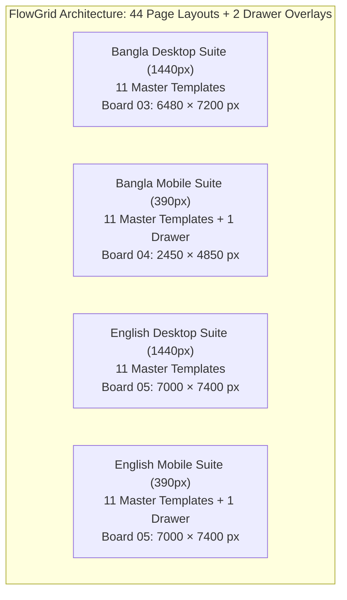

## 2. Complete 44-Page Scope & Layout Accounting Matrix

The FlowGrid design system encompasses exactly **44 full page layouts plus 2 dedicated off-canvas drawer overlays**, structured across three comprehensive layout boards:

### Complete Page-by-Page Register & Exact Canvas Coordinates

All coordinates and dimensions below represent actual, verified SVG root positions from `figma_svgs_v3/03_desktop_bn.svg`, `figma_svgs_v3/04_mobile_bn.svg`, and `figma_svgs_v3/05_english.svg`:

#### Bangla Desktop Suite (Board 03: 6480 × 7200 px)
| # | Screen / Template Name | Viewport | Canvas Coords (x, y) | Dimensions | Rendered PNG Evidence | Verified Status |
|---|---|---|---|---|---|---|
| 1 | Homepage (/) | 1440px | x: 80, y: 260 | 1440 × 2200 | `page_03_desktop_bn.png` | **Verified in local artifact** |
| 2 | Projects Archive (/projects) | 1440px | x: 1680, y: 260 | 1440 × 2200 | `page_03_desktop_bn.png` | **Verified in local artifact** |
| 3 | Concept Study Detail (3 Views) | 1440px | x: 3280, y: 260 | 1440 × 2200 | `page_03_desktop_bn.png` | **Verified in local artifact** |
| 4 | Built-Project Framework | 1440px | x: 4880, y: 260 | 1440 × 2200 | `page_03_desktop_bn.png` | **Verified in local artifact** |
| 5 | Dedicated Services (/services) | 1440px | x: 80, y: 2560 | 1440 × 2200 | `page_03_desktop_bn.png` | **Verified in local artifact** |
| 6 | Service Detail — Joinery | 1440px | x: 1680, y: 2560 | 1440 × 2200 | `page_03_desktop_bn.png` | **Verified in local artifact** |
| 7 | Dedicated Process (/process) | 1440px | x: 3280, y: 2560 | 1440 × 2200 | `page_03_desktop_bn.png` | **Verified in local artifact** |
| 8 | Dedicated Studio (/studio) | 1440px | x: 4880, y: 2560 | 1440 × 2200 | `page_03_desktop_bn.png` | **Verified in local artifact** |
| 9 | Dedicated Contact (/contact) | 1440px | x: 80, y: 4860 | 1440 × 2200 | `page_03_desktop_bn.png` | **Verified in local artifact** |
| 10 | Privacy & Legal (/privacy) | 1440px | x: 1680, y: 4860 | 1440 × 2200 | `page_03_desktop_bn.png` | **Verified in local artifact** |
| 11 | 404 Error Page (/404) | 1440px | x: 3280, y: 4860 | 1440 × 2200 | `page_03_desktop_bn.png` | **Verified in local artifact** |

#### Bangla Mobile Suite (Board 04: 2450 × 4850 px)
| # | Screen / Template Name | Viewport | Canvas Coords (x, y) | Dimensions | Rendered PNG Evidence | Verified Status |
|---|---|---|---|---|---|---|
| 12 | Mobile Homepage (/) | 390px | x: 80, y: 260 | 390 × 3350 | `page_04_mobile_bn.png` | **Verified in local artifact** |
| 13 | Mobile Projects Archive | 390px | x: 550, y: 260 | 390 × 1600 | `page_04_mobile_bn.png` | **Verified in local artifact** |
| 14 | Mobile Concept Study (3 Views) | 390px | x: 550, y: 1920 | 390 × 2000 | `page_04_mobile_bn.png` | **Verified in local artifact** |
| 15 | Mobile Built-Project Framework | 390px | x: 1020, y: 260 | 390 × 1400 | `page_04_mobile_bn.png` | **Verified in local artifact** |
| 16 | Mobile Services Page | 390px | x: 1020, y: 1720 | 390 × 1400 | `page_04_mobile_bn.png` | **Verified in local artifact** |
| 17 | Mobile Service Detail (Joinery) | 390px | x: 1020, y: 3180 | 390 × 1400 | `page_04_mobile_bn.png` | **Verified in local artifact** |
| 18 | Mobile Process Page | 390px | x: 1490, y: 260 | 390 × 1400 | `page_04_mobile_bn.png` | **Verified in local artifact** |
| 19 | Mobile Studio Page | 390px | x: 1490, y: 1720 | 390 × 1400 | `page_04_mobile_bn.png` | **Verified in local artifact** |
| 20 | Mobile Privacy & Legal | 390px | x: 1490, y: 3180 | 390 × 1400 | `page_04_mobile_bn.png` | **Verified in local artifact** |
| 21 | Mobile Contact Page | 390px | x: 1960, y: 260 | 390 × 1450 | `page_04_mobile_bn.png` | **Verified in local artifact** |
| 22 | Mobile 404 Error Screen | 390px | x: 1960, y: 1730 | 390 × 650 | `page_04_mobile_bn.png` | **Verified in local artifact** |
| 23 | Mobile Navigation Drawer Overlay | 390px | x: 1960, y: 2420 | 390 × 750 | `page_04_mobile_bn.png` | **Verified in local artifact** |

#### English Desktop Suite (Board 05: 7000 × 7400 px)
*Reconciled frame heights reflect exact SVG layout rects:*
| # | Screen / Template Name | Viewport | Canvas Coords (x, y) | Dimensions (Reconciled) | Rendered PNG Evidence | Verified Status |
|---|---|---|---|---|---|---|
| 24 | English Homepage (/) | 1440px | x: 80, y: 260 | 1440 × 2500 | `page_05_english.png` | **Verified in local artifact** |
| 25 | English Projects Archive | 1440px | x: 1600, y: 260 | 1440 × 2200 | `page_05_english.png` | **Verified in local artifact** |
| 26 | English 3-View Concept Study | 1440px | x: 3120, y: 260 | 1440 × 2200 | `page_05_english.png` | **Verified in local artifact** |
| 27 | English Built-Project Framework | 1440px | x: 80, y: 2860 | 1440 × 2200 | `page_05_english.png` | **Verified in local artifact** |
| 28 | English Services (/services) | 1440px | x: 1600, y: 2860 | 1440 × 2200 | `page_05_english.png` | **Verified in local artifact** |
| 29 | English Service Detail (Joinery) | 1440px | x: 3120, y: 2860 | 1440 × 2200 | `page_05_english.png` | **Verified in local artifact** |
| 30 | English Process (/process) | 1440px | x: 80, y: 5160 | 1440 × 1950 | `page_05_english.png` | **Verified in local artifact** |
| 31 | English Studio (/studio) | 1440px | x: 1600, y: 5160 | 1440 × 1950 | `page_05_english.png` | **Verified in local artifact** |
| 32 | English Contact (/contact) | 1440px | x: 3120, y: 5160 | 1440 × 1950 | `page_05_english.png` | **Verified in local artifact** |
| 33 | English Privacy & Legal (/privacy) | 1440px | x: 4640, y: 260 | 1440 × 1500 | `page_05_english.png` | **Verified in local artifact** |
| 34 | English 404 Error Page (/404) | 1440px | x: 4640, y: 1860 | 1440 × 900 | `page_05_english.png` | **Verified in local artifact** |

#### English Mobile Suite (Board 05: 7000 × 7400 px)
| # | Screen / Template Name | Viewport | Canvas Coords (x, y) | Dimensions | Rendered PNG Evidence | Verified Status |
|---|---|---|---|---|---|---|
| 35 | English Mobile Homepage | 390px | x: 4640, y: 2860 | 390 × 3350 | `page_05_english.png` | **Verified in local artifact** |
| 36 | English Mobile Archive | 390px | x: 5110, y: 2860 | 390 × 1600 | `page_05_english.png` | **Verified in local artifact** |
| 37 | English Mobile Concept Detail | 390px | x: 5110, y: 4540 | 390 × 2000 | `page_05_english.png` | **Verified in local artifact** |
| 38 | English Mobile Built Framework | 390px | x: 5580, y: 2860 | 390 × 1400 | `page_05_english.png` | **Verified in local artifact** |
| 39 | English Mobile Services Page | 390px | x: 5580, y: 4330 | 390 × 1400 | `page_05_english.png` | **Verified in local artifact** |
| 40 | English Mobile Joinery Detail | 390px | x: 5580, y: 5800 | 390 × 1400 | `page_05_english.png` | **Verified in local artifact** |
| 41 | English Mobile Process Page | 390px | x: 6050, y: 2860 | 390 × 1400 | `page_05_english.png` | **Verified in local artifact** |
| 42 | English Mobile Studio Page | 390px | x: 6050, y: 4330 | 390 × 1400 | `page_05_english.png` | **Verified in local artifact** |
| 43 | English Mobile Privacy & Legal | 390px | x: 6050, y: 5800 | 390 × 1400 | `page_05_english.png` | **Verified in local artifact** |
| 44 | English Mobile Contact Page | 390px | x: 6520, y: 2860 | 390 × 1450 | `page_05_english.png` | **Verified in local artifact** |
| 45 | English Mobile 404 Error Screen | 390px | x: 4640, y: 6280 | 390 × 650 | `page_05_english.png` | **Verified in local artifact** |
| 46 | English Mobile Drawer Overlay | 390px | x: 6520, y: 4380 | 390 × 750 | `page_05_english.png` | **Verified in local artifact** |

**Total Static Scope:** Exactly 44 Page Layouts (22 Desktop + 22 Mobile) + 2 Off-Canvas Drawer Overlays = **46 Distinct Screen & Overlay Artboards**.

---

## 3. Tooling Boundary & Native Figma Checkpoint Clarification

### Figma Tooling Boundary & Authoring Gap Disclosure
To maintain strict transparency regarding what has been programmatically proven versus what requires native Figma client operation:

1. **Tool Capability Limitation:** The available connector exposes only read operations (`get_figma_data`, `download_figma_images`), and no usable native authoring route was available in this session.
2. **Authoring Route Limitation:** While Figma's REST API includes `POST /v1/files/:file_key/variables` endpoints (subject to Enterprise membership, edit access, and applicable scopes), it provides no REST endpoints for programmatic creation or mutation of canvas visual vector nodes, Auto Layout hierarchies, component sets/variants, or interactive prototype connection wires in a cloud file.
3. **Cloud Completion Status:** In accordance with the reviewer's instructions, **native cloud Figma completion status remains OPEN / TOOL-BLOCKED**. The deliverable package provides the complete editable design handoff via master vector SVGs (`figma_svgs_v3/`) and matching 1:1 PNGs (`figma_exports/`), but native cloud components, Auto Layout, variables, and connected prototype flows remain unverified until inspected directly in Figma.
4. **Editable Vector Checkpoint:** The deliverable package provides the complete editable design handoff via **master vector SVGs (`figma_svgs_v3/`)** with structured XML hierarchy, semantic groups, design tokens, and matching **1:1 pixel-accurate PNGs (`figma_exports/`)**. When dragged into Figma, these SVG boards import as editable vector frames, preserving typography, vectors, and embedded imagery.

---