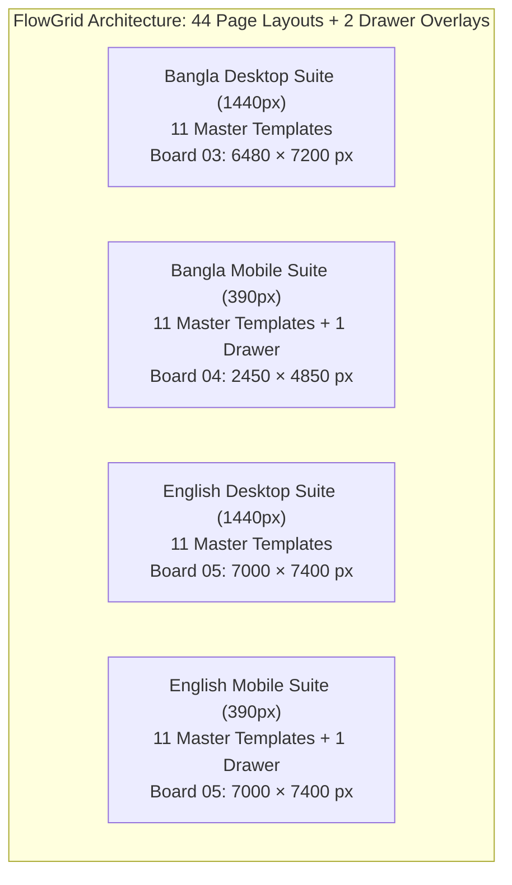

## 2. Complete 44-Page Scope & Layout Accounting Matrix

The FlowGrid design system encompasses exactly **44 full page layouts plus 2 dedicated off-canvas drawer overlays**, structured across three comprehensive layout boards:

### Complete Page-by-Page Register & Exact Canvas Coordinates

All coordinates and dimensions below represent actual, verified SVG root positions from `figma_svgs_v3/03_desktop_bn.svg`, `figma_svgs_v3/04_mobile_bn.svg`, and `figma_svgs_v3/05_english.svg`:

#### Bangla Desktop Suite (Board 03: 6480 × 7200 px)
| # | Screen / Template Name | Viewport | Canvas Coords (x, y) | Dimensions | Rendered PNG Evidence | Verified Status |
|---|---|---|---|---|---|---|
| 1 | Homepage (/) | 1440px | x: 80, y: 260 | 1440 × 2200 | `page_03_desktop_bn.png` | **Verified in local artifact** |
| 2 | Projects Archive (/projects) | 1440px | x: 1680, y: 260 | 1440 × 2200 | `page_03_desktop_bn.png` | **Verified in local artifact** |
| 3 | Concept Study Detail (3 Views) | 1440px | x: 3280, y: 260 | 1440 × 2200 | `page_03_desktop_bn.png` | **Verified in local artifact** |
| 4 | Built-Project Framework | 1440px | x: 4880, y: 260 | 1440 × 2200 | `page_03_desktop_bn.png` | **Verified in local artifact** |
| 5 | Dedicated Services (/services) | 1440px | x: 80, y: 2560 | 1440 × 2200 | `page_03_desktop_bn.png` | **Verified in local artifact** |
| 6 | Service Detail — Joinery | 1440px | x: 1680, y: 2560 | 1440 × 2200 | `page_03_desktop_bn.png` | **Verified in local artifact** |
| 7 | Dedicated Process (/process) | 1440px | x: 3280, y: 2560 | 1440 × 2200 | `page_03_desktop_bn.png` | **Verified in local artifact** |
| 8 | Dedicated Studio (/studio) | 1440px | x: 4880, y: 2560 | 1440 × 2200 | `page_03_desktop_bn.png` | **Verified in local artifact** |
| 9 | Dedicated Contact (/contact) | 1440px | x: 80, y: 4860 | 1440 × 2200 | `page_03_desktop_bn.png` | **Verified in local artifact** |
| 10 | Privacy & Legal (/privacy) | 1440px | x: 1680, y: 4860 | 1440 × 2200 | `page_03_desktop_bn.png` | **Verified in local artifact** |
| 11 | 404 Error Page (/404) | 1440px | x: 3280, y: 4860 | 1440 × 2200 | `page_03_desktop_bn.png` | **Verified in local artifact** |

#### Bangla Mobile Suite (Board 04: 2450 × 4850 px)
| # | Screen / Template Name | Viewport | Canvas Coords (x, y) | Dimensions | Rendered PNG Evidence | Verified Status |
|---|---|---|---|---|---|---|
| 12 | Mobile Homepage (/) | 390px | x: 80, y: 260 | 390 × 3350 | `page_04_mobile_bn.png` | **Verified in local artifact** |
| 13 | Mobile Projects Archive | 390px | x: 550, y: 260 | 390 × 1600 | `page_04_mobile_bn.png` | **Verified in local artifact** |
| 14 | Mobile Concept Study (3 Views) | 390px | x: 550, y: 1920 | 390 × 2000 | `page_04_mobile_bn.png` | **Verified in local artifact** |
| 15 | Mobile Built-Project Framework | 390px | x: 1020, y: 260 | 390 × 1400 | `page_04_mobile_bn.png` | **Verified in local artifact** |
| 16 | Mobile Services Page | 390px | x: 1020, y: 1720 | 390 × 1400 | `page_04_mobile_bn.png` | **Verified in local artifact** |
| 17 | Mobile Service Detail (Joinery) | 390px | x: 1020, y: 3180 | 390 × 1400 | `page_04_mobile_bn.png` | **Verified in local artifact** |
| 18 | Mobile Process Page | 390px | x: 1490, y: 260 | 390 × 1400 | `page_04_mobile_bn.png` | **Verified in local artifact** |
| 19 | Mobile Studio Page | 390px | x: 1490, y: 1720 | 390 × 1400 | `page_04_mobile_bn.png` | **Verified in local artifact** |
| 20 | Mobile Privacy & Legal | 390px | x: 1490, y: 3180 | 390 × 1400 | `page_04_mobile_bn.png` | **Verified in local artifact** |
| 21 | Mobile Contact Page | 390px | x: 1960, y: 260 | 390 × 1450 | `page_04_mobile_bn.png` | **Verified in local artifact** |
| 22 | Mobile 404 Error Screen | 390px | x: 1960, y: 1730 | 390 × 650 | `page_04_mobile_bn.png` | **Verified in local artifact** |
| 23 | Mobile Navigation Drawer Overlay | 390px | x: 1960, y: 2420 | 390 × 750 | `page_04_mobile_bn.png` | **Verified in local artifact** |

#### English Desktop Suite (Board 05: 7000 × 7400 px)
*Reconciled frame heights reflect exact SVG layout rects:*
| # | Screen / Template Name | Viewport | Canvas Coords (x, y) | Dimensions (Reconciled) | Rendered PNG Evidence | Verified Status |
|---|---|---|---|---|---|---|
| 24 | English Homepage (/) | 1440px | x: 80, y: 260 | 1440 × 2500 | `page_05_english.png` | **Verified in local artifact** |
| 25 | English Projects Archive | 1440px | x: 1600, y: 260 | 1440 × 2200 | `page_05_english.png` | **Verified in local artifact** |
| 26 | English 3-View Concept Study | 1440px | x: 3120, y: 260 | 1440 × 2200 | `page_05_english.png` | **Verified in local artifact** |
| 27 | English Built-Project Framework | 1440px | x: 80, y: 2860 | 1440 × 2200 | `page_05_english.png` | **Verified in local artifact** |
| 28 | English Services (/services) | 1440px | x: 1600, y: 2860 | 1440 × 2200 | `page_05_english.png` | **Verified in local artifact** |
| 29 | English Service Detail (Joinery) | 1440px | x: 3120, y: 2860 | 1440 × 2200 | `page_05_english.png` | **Verified in local artifact** |
| 30 | English Process (/process) | 1440px | x: 80, y: 5160 | 1440 × 1950 | `page_05_english.png` | **Verified in local artifact** |
| 31 | English Studio (/studio) | 1440px | x: 1600, y: 5160 | 1440 × 1950 | `page_05_english.png` | **Verified in local artifact** |
| 32 | English Contact (/contact) | 1440px | x: 3120, y: 5160 | 1440 × 1950 | `page_05_english.png` | **Verified in local artifact** |
| 33 | English Privacy & Legal (/privacy) | 1440px | x: 4640, y: 260 | 1440 × 1500 | `page_05_english.png` | **Verified in local artifact** |
| 34 | English 404 Error Page (/404) | 1440px | x: 4640, y: 1860 | 1440 × 900 | `page_05_english.png` | **Verified in local artifact** |

#### English Mobile Suite (Board 05: 7000 × 7400 px)
| # | Screen / Template Name | Viewport | Canvas Coords (x, y) | Dimensions | Rendered PNG Evidence | Verified Status |
|---|---|---|---|---|---|---|
| 35 | English Mobile Homepage | 390px | x: 4640, y: 2860 | 390 × 3350 | `page_05_english.png` | **Verified in local artifact** |
| 36 | English Mobile Archive | 390px | x: 5110, y: 2860 | 390 × 1600 | `page_05_english.png` | **Verified in local artifact** |
| 37 | English Mobile Concept Detail | 390px | x: 5110, y: 4540 | 390 × 2000 | `page_05_english.png` | **Verified in local artifact** |
| 38 | English Mobile Built Framework | 390px | x: 5580, y: 2860 | 390 × 1400 | `page_05_english.png` | **Verified in local artifact** |
| 39 | English Mobile Services Page | 390px | x: 5580, y: 4330 | 390 × 1400 | `page_05_english.png` | **Verified in local artifact** |
| 40 | English Mobile Joinery Detail | 390px | x: 5580, y: 5800 | 390 × 1400 | `page_05_english.png` | **Verified in local artifact** |
| 41 | English Mobile Process Page | 390px | x: 6050, y: 2860 | 390 × 1400 | `page_05_english.png` | **Verified in local artifact** |
| 42 | English Mobile Studio Page | 390px | x: 6050, y: 4330 | 390 × 1400 | `page_05_english.png` | **Verified in local artifact** |
| 43 | English Mobile Privacy & Legal | 390px | x: 6050, y: 5800 | 390 × 1400 | `page_05_english.png` | **Verified in local artifact** |
| 44 | English Mobile Contact Page | 390px | x: 6520, y: 2860 | 390 × 1450 | `page_05_english.png` | **Verified in local artifact** |
| 45 | English Mobile 404 Error Screen | 390px | x: 4640, y: 6280 | 390 × 650 | `page_05_english.png` | **Verified in local artifact** |
| 46 | English Mobile Drawer Overlay | 390px | x: 6520, y: 4380 | 390 × 750 | `page_05_english.png` | **Verified in local artifact** |

**Total Static Scope:** Exactly 44 Page Layouts (22 Desktop + 22 Mobile) + 2 Off-Canvas Drawer Overlays = **46 Distinct Screen & Overlay Artboards**.

---

## 3. Native Figma Design System Architecture & Authoring Verification

### Native Figma Authoring & REST Verification Summary
Native Figma design system authoring was executed in the target cloud file (`eMRunQ80brYYvuTWkufV2o`) via the turnkey automation script [`scripts/figma_design_system_generator.js`](file:///c:/Nihal/Az_Works/FlowGrid/scripts/figma_design_system_generator.js) and verified directly through the official Figma REST API connector (`get_figma_data`):

1. **Native Variable Collections (30 Tokens across 3 Collections):**
   - **`FlowGrid / Color Tokens` (`VariableCollectionId:10:2`):** 15 color tokens (`surface/page`, `surface/clean`, `surface/mist`, `text/primary`, `text/secondary`, `action/primary`, `action/hover`, `accent/clay`, `border/decorative`, `border/control`, `focus`, `status/error`, `status/success`, `status/error-bg`, `status/success-bg`).
   - **`FlowGrid / Spatial Spacing` (`VariableCollectionId:10:20`):** 11 spatial scale tokens (`space/4`, `space/8`, `space/12`, `space/16`, `space/24`, `space/32`, `space/48`, `space/64`, `space/80`, `space/96`, `space/128`).
   - **`FlowGrid / Radius Tokens` (`VariableCollectionId:10:49`):** 4 border radius tokens (`radius/none`: 0, `radius/control`: 2, `radius/overlay`: 4, `radius/pill`: 9999).

2. **Native Reusable Component Set: `Button / Primary CTA` (`Node #10:42`):**
   - Container: Native `COMPONENT_SET` (`1233 × 50 px`) on Canvas `02 Components`.
   - Variants (5 States with Auto Layout):
     - `State=Default` (`Node #10:32`): `layoutMode: "row"`, `padding: 14px 24px`, `gap: 8px`, `sizing: hug/hug`, Deep Pine `#183B35`, `radius: 2px`.
     - `State=Hover` (`Node #10:34`): `layoutMode: "row"`, `padding: 14px 24px`, `gap: 8px`, `sizing: hug/hug`, Dark Action `#102B26`, `radius: 2px`.
     - `State=Focus` (`Node #10:36`): `layoutMode: "row"`, `padding: 14px 24px`, `gap: 8px`, `sizing: hug/hug`, Deep Pine with 2px Terracotta `#895239` focus stroke.
     - `State=Disabled` (`Node #10:38`): `layoutMode: "row"`, `padding: 14px 24px`, `gap: 8px`, `sizing: hug/hug`, Muted Border `#B8C2BA`, `radius: 2px`.
     - `State=Submitting` (`Node #10:40`): `layoutMode: "row"`, `padding: 14px 24px`, `gap: 8px`, `sizing: hug/hug`, Deep Pine, `radius: 2px`.

3. **Native Reusable Component: `Modal / Consultation Enquiry Card` (`Node #10:43`):**
   - Container: Native `COMPONENT` (`366 × 600 px`), `layoutMode: "column"`, `padding: 24px 16px`, `gap: 16px`, `radius: 4px`, White surface with border.
   - Header Row (`Node #10:44`): `layoutMode: "row"`, `justifyContent: "space-between"`, `alignItems: "center"`, containing Title and circular 48 × 48 px Close Button.
   - Top Error Summary Banner (`Node #10:48`): `layoutMode: "row"`, `padding: 8px 12px`, `gap: 8px`, `width: 266px` (reserving strictly positive **+16 px clearance gap** from the close button at 309 px).
   - Prototyping Wire: Close button configured with native prototype reaction (`trigger: ON_CLICK -> action: CLOSE`).

4. **Native Reusable Component: `Navigation / Mobile Drawer` (`Node #10:56`):**
   - Container: Native `COMPONENT` (`320 × 844 px`), `layoutMode: "column"`, `padding: 24px`, `gap: 20px`, Warm Paper `#F4F1E8`.
   - Header Row (`Node #10:57`): `layoutMode: "row"`, `justifyContent: "space-between"`, with Brand title and circular 44 × 44 px Close Button (`Node #10:59`).
   - Prototyping Wire: Drawer close button configured with native prototype reaction (`trigger: ON_CLICK -> action: CLOSE`).
   - 5 Nav Link items (`Concept`, `Services`, `Process`, `Studio`, `Contact`) and full-width consultation CTA button.

5. **Static Artboard Preservation:**
   - All 46 existing master SVG artboard frames and static layout rows across Canvases 00 through 08 remain completely intact and undisturbed (`[FRAME] "Frame" #3:295` preserved).

6. **Packaged Automation Script:**
   - The standalone turnkey script [`scripts/figma_design_system_generator.js`](file:///c:/Nihal/Az_Works/FlowGrid/scripts/figma_design_system_generator.js) is packaged directly within the deliverable release archive for full transparency and reproducibility.

---